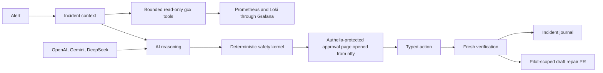

# BodhiSpace AI SRE

GitOps-aware incident investigation and supervised remediation for the BodhiSpace homelab.

> This project is in the architecture and requirements stage. It does not yet have authority to change the homelab.

## What it will do

- Receive incidents from the existing monitoring and notification path.
- Build incident context from GitOps state, Prometheus metrics, Loki logs, deployment history, and runtime health.
- Use a Rust/Rig reasoning layer to produce evidence-backed diagnoses and bounded remediation proposals.
- Try complete reasoning runs through OpenAI ChatGPT OAuth, Gemini API, and DeepSeek API in that order, falling back to deterministic enrichment when every provider is unavailable or invalid.
- Enforce durable per-incident and global limits on reasoning turns, tokens, evidence queries, elapsed time, and billed API cost so provider fallback or process restart cannot create an endless loop or reset spend.
- Journal per-incident phase timing, machine work, operator wait, provider/tool usage, tokens, budget utilization, estimated billed cost, and outcome so Grafana can show which resolution paths are fast, cheap, and effective.
- Require deterministic policy checks and operator approval initiated through ntfy and verified by the AI SRE before an MVP runtime action can execute.
- Record decisions, approvals, actions, verification, and outcomes in a durable incident journal.
- Submit typed repairs for one pilot stack as protected draft GitOps pull requests; produce recommendations for changes outside that boundary.

## Safety model

AI proposes; policy authorizes; typed tools execute; telemetry proves.

The MVP begins in shadow mode and later permits only approved, typed, low-blast-radius actions with fixed verification, predefined safe compensation when one exists, and explicit stop/escalation otherwise. Arbitrary shell execution, destructive actions, automatic pull-request merging, and production self-modification are outside the product boundary.

The investigator may decide which PromQL and LogQL evidence it needs, but it receives only typed read-only tools. Rust invokes fixed `gcx` subcommands and arguments with a read-only Grafana identity, budgets, redaction, and provenance; the model never receives a shell or generic Grafana API. Independent fixed queries—not the investigator—decide whether an action recovered the service.

The reasoning roles form a finite pipeline, not a group chat: investigator → diagnostician → planner → critic → deterministic safety kernel. The investigator gets at most two evidence rounds, each provider is attempted at most once, and a rejected or exhausted run ends in abstention or deterministic enrichment. Gemini and DeepSeek are skipped unless explicit incident, daily, and monthly cost ceilings and current price data are configured.

Prometheus exposes only low-cardinality aggregates; the journal retains the reconstructable per-incident facts. Machine time and human approval wait are measured separately, and an OAuth run with no trustworthy monetary price is reported as cost unknown—not as free.

## Architecture



The first deployable slice ends at a shadow-mode report and ntfy notification. OpenTelemetry is emitted from that first slice without making export a dependency; Tempo is added later in the MVP before supervised mutation is enabled.

The complete product contract, MVP scope, acceptance examples, capability boundaries, and research foundations are in the [BodhiSpace AI SRE plan](docs/plans/2026-08-10-001-feat-bodhispace-ai-sre-plan.md).

Contributor-facing Rust documentation and test readability rules are in
[Rust documentation and test style](docs/engineering/rust-documentation-and-test-style.md).

## Local development

The `Makefile` keeps local validation aligned with the Rust CI workflow:

```text
make run ARGS="--help"  # run the binary
make test                # run the CI nextest profile
make ci                  # run formatting, Clippy, tests, docs, and cargo-deny
```

Install the pinned CI-only tools once with `make install-ci-tools`.
Use `make help` to see every available command.

If Nix and direnv are installed, run `direnv allow` once in the repository.
The committed `.envrc` then activates the locked project development shell on
entry; `nix develop` remains available as the explicit equivalent.

### Paid-provider budget configuration

Gemini and DeepSeek remain disabled unless all of the following are present:

- `GEMINI_GATE=accepted` or `DEEPSEEK_GATE=accepted`;
- the provider API key and non-empty price catalog;
- `AI_SRE_DAILY_COST_LIMIT_MICRO_USD` and `AI_SRE_MONTHLY_COST_LIMIT_MICRO_USD`;
- current window identifiers in `AI_SRE_BUDGET_DAY` and `AI_SRE_BUDGET_MONTH`.

Each investigation reserves its worst-case paid-provider amount atomically in
the incident, day, and month ledgers. Unknown provider usage remains reserved;
only trustworthy actual usage can reconcile and release the difference.
