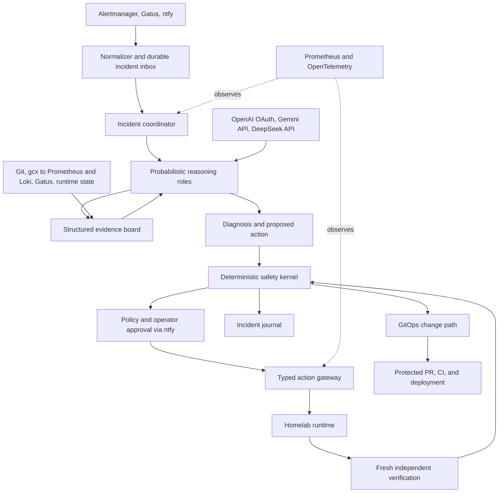
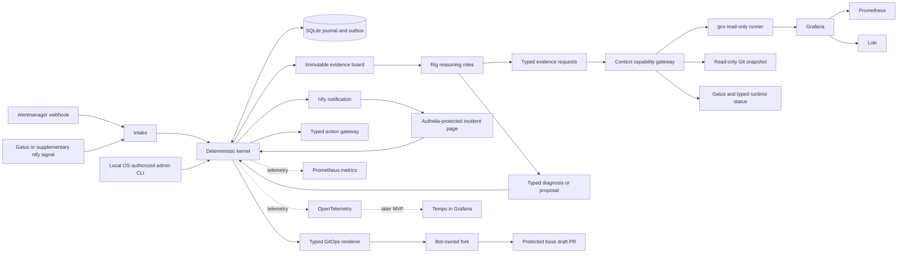
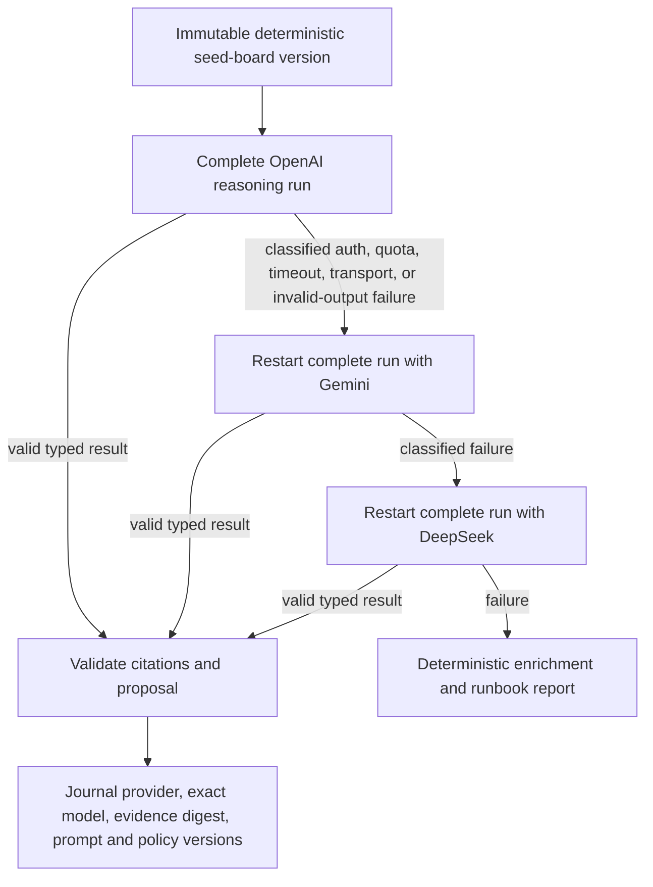
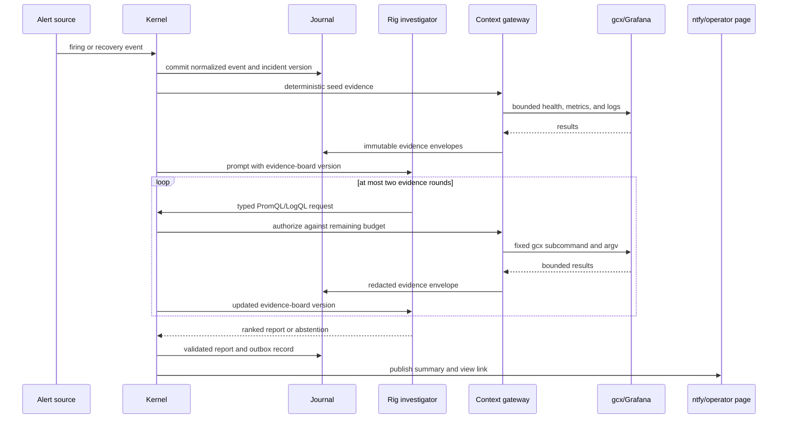
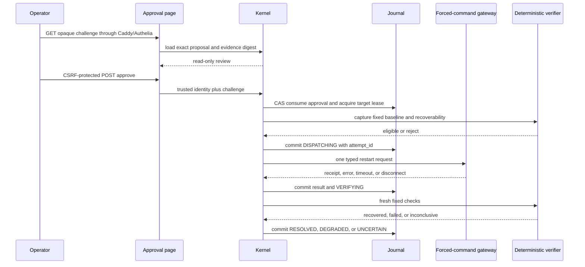
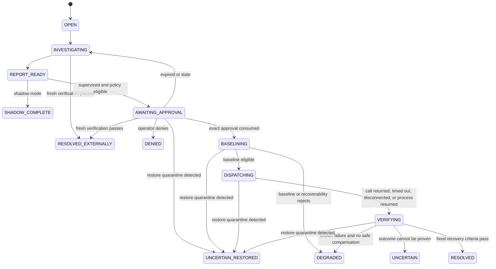

# BodhiSpace AI SRE - Plan

## Goal Capsule

- **Objective:** Build a GitOps-aware AI SRE that investigates homelab incidents and safely performs supervised remediation.
- **Product authority:** This contract defines the full-system safety architecture and the MVP boundary. Implementation planning covers only the MVP.
- **Desired-state authority:** The `bodhispace-homelab` repository remains authoritative for lasting infrastructure and service configuration.
- **Deployment boundary:** The MVP runs as one service in a dedicated PBS-backed LXC. Complete Proxmox or LXC failure remains outside its live remediation capability.
- **Delivery order:** Ship and evaluate the shadow context slice first. Gate A permits mutation staging only; Gate B is required before runtime authority, and Gate C is required before external GitHub write authority.
- **Open blockers:** None.

---

## Product Contract

### Summary

BodhiSpace AI SRE will turn existing homelab alerts into durable, evidence-backed incident workflows.
It will begin in shadow mode, then perform only typed low-blast-radius actions after operator approval initiated through ntfy and authenticated, bound, and consumed by the AI SRE while deterministic controls govern execution, predefined safe compensation when available, and explicit stop/escalation otherwise.

The implementation is a Rust modular monolith. Rig supplies the probabilistic reasoning abstraction; OpenAI ChatGPT OAuth is primary, Gemini API is the first fallback, and DeepSeek API is the second fallback. The investigator may choose read-only PromQL and LogQL through a bounded `gcx` gateway, while deterministic verification remains fixed by policy.

### Product Contract Preservation

This implementation plan does not reopen the product contract. One deployable, the dedicated LXC boundary, Git authority, shadow-first rollout, ntfy-as-transport, deterministic execution authority, best-effort compensation, and the prohibition on arbitrary shell remain settled. Frameworks and model providers are replaceable implementation details and cannot expand product authority.

### Problem Frame

The homelab already reports service failures through Alertmanager and Gatus to ntfy, but notification alone leaves diagnosis, recovery, validation, and durable correction to the operator.
The GitOps repository, Prometheus metrics, centralized Loki logs, deployment history, and runtime state contain the evidence needed to investigate these incidents, yet no active automated remediation system is represented in the current desired state.

An LLM can interpret incomplete evidence and propose likely explanations, but its output is probabilistic and cannot safely own infrastructure authority.
The product therefore needs a strict boundary between reasoning and deterministic control, plus a durable record that survives process restarts and supports later evaluation.

### Key Decisions

- **One deployable with internal reasoning roles** (session-settled: user-approved — chosen over separately deployed agent services: it preserves useful specialization without creating a swarm to operate). Governs R1 and R2.
- **Dedicated PBS-backed LXC** (session-settled: user-approved — chosen over a fully external control plane: simpler homelab operation is worth accepting that the responder is unavailable during a complete Proxmox outage). Governs R3 and R4.
- **Supervised remediation after shadow mode** (session-settled: user-approved — chosen over both recommendation-only operation and immediate autonomy: it delivers real recovery while keeping early decisions human-gated). ntfy transports approval requests; the AI SRE owns approval authentication, binding, consumption, and authorization. Governs R11 and R12.
- **Git remains the desired-state authority** (session-settled: user-approved — chosen over permanent live edits: protected pull requests preserve review, validation, history, and rollback). Governs R18 through R20.
- **Controlled improvement, not live self-modification** (session-settled: user-approved — chosen over autonomous prompt, policy, permission, or code changes: improvement must remain reviewable and regression-tested). Governs R24 and R25.
- **Existing monitoring plus open telemetry:** Prometheus measures responder health, Loki supplies operational logs, traces explain an incident run, and the incident journal remains authoritative. Governs R9 and R21 through R23.
- **Finite incident budgets with journal-derived efficiency** (session-settled: user-approved — chosen over open-ended agent loops and telemetry-only accounting: every incident must terminate under a fixed allowance, and durable facts must show how quickly and cheaply each outcome was reached). Governs R26 and R27.

### Actors

| ID | Actor | Responsibility |
| --- | --- | --- |
| A1 | Homelab operator | Reviews diagnosis, approves or denies actions, and owns policy changes. |
| A2 | Alert sources | Alertmanager, Gatus, and ntfy initiate or update incident signals. |
| A3 | Reasoning layer | Selects evidence, ranks hypotheses, proposes plans, critiques them, and interprets fresh results. |
| A4 | Deterministic safety kernel | Owns workflow state, policy, locks, credentials, retry classification, execution, compensation decisions, and terminal status. |
| A5 | Evidence and action systems | Git, Prometheus, Loki, host or workload APIs, and typed executors expose scoped capabilities. |
| A6 | GitOps delivery path | GitHub review, CI, and the existing homelab deployment workflow apply lasting repairs. |

### Full-System Reference Architecture

The full system preserves one authority boundary: the reasoning layer may propose, while deterministic software authorizes, executes, and proves outcomes.
The MVP implements this shape inside one deployable service rather than separate agent services.



### Requirements

**System and authority boundary**

- R1. The MVP shall run as one deployable service whose agent specializations are logical reasoning roles rather than independently operated services.
- R2. The reasoning layer may select evidence, rank hypotheses, propose actions, critique plans, and interpret results, but it shall not hold execution authority.
- R3. The service shall run in a dedicated LXC whose persistent incident data is included in PBS-backed recovery.
- R4. The product shall state that it cannot remediate incidents that make its LXC or Proxmox host unavailable.
- R5. Deterministic software shall own workflow transitions, authorization, locks, credentials, retry classification and limits, execution, compensation decisions, and terminal status.

**Incident intake and evidence**

- R6. The system shall normalize, deduplicate, and correlate incoming alert and recovery events into a stable incident identity.
- R7. The incident journal shall durably record workflow state, evidence references, decisions, approvals, actions, verification, rollback, and outcome before each transition is acknowledged.
- R8. Restarting the AI SRE shall resume an incomplete incident without repeating an already recorded mutation.
- R9. Evidence collection shall be read-only by default, and all routine log evidence shall use bounded Loki queries instead of direct host, container, or SSH log access.
- R10. The reasoning layer shall produce ranked hypotheses and a minimal remediation proposal that cites supporting evidence, uncertainty, expected impact, verification criteria, and predefined compensation when available or an explicit stop and escalation strategy.

**Autonomy and transactional remediation**

- R11. Every deployment shall begin in shadow mode, where the system may investigate and recommend but cannot mutate the homelab.
- R12. The MVP may execute a runtime mutation only after operator approval initiated through ntfy and authenticated, bound, and atomically consumed by the deterministic safety kernel. The approval shall be expiring and single-use and shall bind the incident, target, action, parameters, and evidence version; ntfy is the transport and interaction surface, not the authorization authority.
- R13. Mutations shall use typed allowlisted operations with least-privilege credentials; arbitrary model-generated shell execution is prohibited.
- R14. The safety kernel shall lock the target resource, enforce idempotency, and permit at most one mutation attempt for each approval and evidence version. A timeout or ambiguous result shall transition to observation and verification rather than automatic mutation retry; another attempt requires fresh evidence and a new approval.
- R15. Each runtime mutation shall follow a transactional loop of baseline capture, recoverability assessment, one mutation, and fresh verification. The system shall commit only when recorded recovery criteria hold; otherwise it shall attempt a predefined compensation when one is available and safe, or stop in an explicit degraded or uncertain terminal state and escalate to the operator. Compensation is best-effort and shall not be represented as a guarantee of restoring the original state.
- R16. The MVP runtime allowlist shall support a policy-scoped service restart and a GitOps reconciliation of one stack.
- R17. During the MVP, storage-changing, secret-changing, firewall-changing, and Proxmox-changing actions shall remain prohibited or human-operated outside the agent. A future reviewed product and policy change may admit only narrowly typed, reversible operations in those domains; destructive or irreversible recovery operations shall remain human-only.

**GitOps and observability**

- R18. Within the selected pilot stack, the deterministic safety kernel may create a minimal draft pull request containing only typed allowlisted configuration changes without a separate ntfy-initiated approval. This proposal authority shall not include merging or approving the pull request, writing protected branches, modifying GitHub workflows, secrets, or repository rules, or triggering deployment; outside the pilot boundary the system shall produce an evidence-backed recommendation only.
- R19. A repair pull request shall reference its incident, supporting evidence, validation result, expected effect, and rollback path without containing secrets or raw sensitive evidence.
- R20. The existing repository validation and deployment controls shall remain authoritative for accepting and applying GitOps repairs.
- R21. The service shall expose low-cardinality health, latency, failure, approval, action, rollback, and outcome metrics to Prometheus.
- R22. The service shall emit redacted OpenTelemetry traces for incident workflow, evidence, reasoning, policy, tool, approval, execution, verification, and rollback activity.
- R23. The incident journal shall remain the authoritative workflow record even when metrics, traces, or operational logs expire.

**Evaluation foundation**

- R24. Past incidents shall support replay-based evaluation of evidence selection, diagnosis, action safety, recovery, rollback, and escalation behavior before a candidate behavior is promoted.
- R25. Shadow and replay evaluation shall compare AI-assisted investigation against a deterministic alert-enrichment and runbook baseline. Supervised remediation shall not be enabled until predeclared evaluation criteria show that AI reasoning adds useful diagnosis or coverage without reducing evidence correctness or safety.
- R26. Every reasoning cycle shall terminate under durable incident-level and global budgets for elapsed time, model turns, input/output tokens, evidence rounds, tool calls, and estimated billed-provider cost. Duplicate alerts, provider fallback, critic rejection, and process restart shall not replenish a budget. Exhaustion shall stop further model/tool calls and publish the deterministic baseline; no role may recursively invoke itself or another role without consuming a finite predeclared turn.
- R27. The journal shall record the immutable timing and resource facts needed to reconstruct each incident's efficiency: phase boundaries, provider attempts, model tokens, evidence/tool calls, budget reservations and reconciliations, estimated billed cost, human-wait time, and terminal outcome. Prometheus and evaluation reports shall derive low-cardinality aggregates such as time-to-first-report, time-to-resolution, active machine time, and estimated cost per successful outcome from those facts; unavailable monetary cost shall remain explicitly unknown rather than being treated as zero.

### Key Flows

- F1. Shadow investigation
  - **Trigger:** A2 emits a new failure signal.
  - **Actors:** A2, A3, A4, A5, A1
  - **Steps:** The service correlates the signal, gathers targeted evidence, records hypotheses and proposes a bounded response without executing it.
  - **Outcome:** A1 receives an ntfy explanation and the journal contains a replayable incident.
  - **Covers:** R6 through R11, R21 through R27.
- F2. Supervised remediation
  - **Trigger:** A shadow-proven policy permits a proposed typed low-blast-radius action to request approval.
  - **Actors:** A1, A3, A4, A5
  - **Steps:** A4 records the exact proposed action, publishes an approval interaction through ntfy, authenticates and atomically consumes the operator response through the AI SRE approval endpoint, establishes a baseline, executes one typed action, and verifies fresh health evidence.
  - **Outcome:** The incident resolves only when explicit recovery criteria hold.
  - **Covers:** R12 through R17, R23, and R27.
- F3. Failed or uncertain remediation
  - **Trigger:** The action errors, verification fails, the target regresses, or the result remains ambiguous.
  - **Actors:** A3, A4, A5, A1
  - **Steps:** A4 stops additional mutation, attempts a predefined safe compensation when available, verifies the post-action or post-compensation state, records any degraded or uncertain outcome, and escalates through ntfy.
  - **Outcome:** The system stops safely with an auditable explanation instead of looping.
  - **Covers:** R14, R15, R17, R23, and R27.
- F4. Permanent GitOps repair
  - **Trigger:** An incident reveals that desired-state configuration must change to prevent recurrence.
  - **Actors:** A3, A4, A6, A1
  - **Steps:** For the selected pilot stack, deterministic policy permits a typed allowlisted change to a minimal branch and draft pull request, runs repository validation, reports the result through ntfy, and waits for protected review and merge. Other desired-state corrections remain evidence-backed recommendations.
  - **Outcome:** A6 applies the reviewed desired-state change and the AI SRE observes the deployment outcome.
  - **Covers:** R18 through R20 and R27.

### Acceptance Examples

- AE1. Duplicate alert correlation
  - **Covers R6 and R7.**
  - **Given:** Multiple equivalent failure notifications identify the same resource within an active incident window.
  - **When:** The service receives the notifications.
  - **Then:** It updates one incident and does not start competing remediation workflows.
- AE2. Shadow-mode proposal
  - **Covers R10 and R11.**
  - **Given:** A service is unhealthy and sufficient evidence supports a restart hypothesis.
  - **When:** The AI SRE is in shadow mode.
  - **Then:** It sends the evidence-backed proposal through ntfy and records no mutation attempt.
- AE3. Bound approval
  - **Covers R12 through R14.**
  - **Given:** The operator uses an approval interaction delivered through ntfy for a specific service restart.
  - **When:** The AI SRE approval endpoint authenticates the operator, verifies that the approval is unused and unexpired, and confirms that the bound target evidence has not changed.
  - **Then:** The gateway executes that exact operation once and rejects parameter substitution or replay.
- AE4. Stale approval
  - **Covers R12.**
  - **Given:** An approval has expired or the target state changed after it was requested.
  - **When:** The service attempts to validate the approval.
  - **Then:** No action runs and a new evidence-backed request is required.
- AE5. Command success without recovery
  - **Covers R15 and R23.**
  - **Given:** A typed restart returns success but the health criteria remain failed.
  - **When:** Fresh verification completes.
  - **Then:** The incident is not marked resolved; the service attempts a predefined safe compensation when available or stops in a recorded degraded or uncertain state and escalates according to policy.
- AE6. Coordinator restart after mutation
  - **Covers R7 and R8.**
  - **Given:** The AI SRE restarts after recording a mutation but before completing verification.
  - **When:** It resumes the incident.
  - **Then:** It continues verification instead of repeating the mutation.
- AE7. Durable configuration correction
  - **Covers R18 through R20.**
  - **Given:** Recovery evidence shows that a typed allowlisted desired-state change is needed in the selected pilot stack.
  - **When:** The service prepares the correction.
  - **Then:** Deterministic policy permits it to open a minimal validated draft pull request without a separate ntfy-initiated approval, but it cannot approve, merge, deploy, or modify files outside the allowlist.
- AE8. Replay regression gate
  - **Covers R24.**
  - **Given:** A candidate prompt, model, policy, or agent change performs worse on a recorded incident outcome.
  - **When:** The replay evaluation completes.
  - **Then:** The candidate is rejected and the running system remains unchanged.
- AE9. Centralized log investigation
  - **Covers R9.**
  - **Given:** An incident affects a service running on any managed LXC whose logs are collected centrally.
  - **When:** The investigator requests log evidence.
  - **Then:** It issues a time-bounded, label-scoped Loki query and does not retrieve routine logs through SSH or a container runtime.
- AE10. Deterministic baseline comparison
  - **Covers R25.**
  - **Given:** Representative replay or shadow incidents can be investigated by both deterministic enrichment and AI-assisted reasoning.
  - **When:** The evaluation compares their evidence correctness, diagnosis usefulness, coverage, latency, and operator effort using criteria declared before results are inspected.
  - **Then:** Supervised remediation remains disabled unless the AI-assisted path adds useful diagnosis or coverage without weakening evidence correctness or safety.
- AE11. Cost and loop exhaustion
  - **Covers R26.**
  - **Given:** An investigator requests more evidence, a critic rejects a proposal, or provider fallback would exceed a persisted turn, token, time, query, or billed-cost budget.
  - **When:** The kernel evaluates the next external call.
  - **Then:** It rejects the call, records the exhausted dimension, publishes deterministic enrichment, and cannot regain budget through a duplicate alert, provider switch, or process restart.
- AE12. Resolution efficiency accounting
  - **Covers R27.**
  - **Given:** An incident reaches a report or terminal outcome after using one or more providers, evidence queries, and possibly human approval.
  - **When:** The efficiency projection is rebuilt from the journal.
  - **Then:** It reproduces phase duration, active machine time, separate human-wait time, tokens, tool calls, estimated billed cost or explicit unknown cost, budget utilization, provider path, and outcome without relying on Prometheus or traces.

### Full-System Capability Map

The capability map provides direction rather than a committed implementation roadmap.

1. **Shadow investigation:** Collect evidence, explain incidents, recommend actions, and build the evaluation corpus.
2. **Supervised remediation:** Execute typed low-blast-radius actions after bound operator approval initiated through ntfy and verified by the AI SRE, using predefined safe compensation when available or explicit stop and escalation. This and shadow investigation form the MVP.
3. **Earned autonomy:** Promote autonomy per action type through a reviewed Git change only after replay and observed outcomes show it is safe.
4. **Broader resilience:** Add an external watchdog, multiple instances, or stronger workflow infrastructure only when real failure or scale data demands it.

### Success Criteria

- A synthetic alert can complete F1 with a coherent incident journal, targeted evidence, a ranked diagnosis, and an ntfy recommendation.
- A supervised allowlisted runtime action cannot execute without the exact valid operator approval required by R12; receiving or publishing an ntfy message alone cannot authorize execution.
- Successful command execution cannot resolve an incident unless fresh health evidence meets the recorded criteria.
- A failed or ambiguous mutation is not retried automatically, and it ends with verified recovery, a verified compensation, or a recorded degraded or uncertain state and clear human escalation.
- Restart recovery continues the recorded state machine without duplicating a mutation.
- A permanent repair within the selected pilot boundary reaches review as a minimal draft pull request that passes the authoritative repository checks and cannot be approved, merged, or deployed by the agent; repairs outside that boundary remain recommendations.
- Metrics and traces allow an operator to reconstruct system health and incident execution without exposing secrets or full sensitive payloads.
- Loki provides the investigator with the routine log evidence needed for an incident without per-host log access.
- Historical incident replay can detect a regression before an agent, prompt, policy, model, or autonomy change is promoted.
- Before supervised remediation is enabled, a shadow-mode evaluation compares per-incident and median diagnosis time, hands-on operator effort, evidence correctness, and unactionable recommendation rate against a recorded manual and deterministic baseline using thresholds declared before results are inspected.
- AI-assisted investigation demonstrates useful diagnosis or coverage beyond deterministic alert enrichment and runbooks without weakening evidence correctness or safety.
- Every reasoning cycle terminates under its persisted allowance, and exhaustion publishes deterministic enrichment without another model or tool call.
- Journal replay reconstructs phase, provider/tool, human-wait, resource, known-or-unknown cost, and terminal-outcome efficiency facts without relying on Prometheus or traces.

### Scope Boundaries

**MVP**

- One deployable AI SRE service in a dedicated PBS-backed LXC.
- Shadow investigation followed by supervised remediation using operator approval initiated through ntfy and verified by the AI SRE.
- A durable incident journal, targeted Prometheus and Loki evidence access, typed low-blast-radius actions, independent verification, pilot-scoped typed GitOps pull requests, Prometheus metrics, and OpenTelemetry traces.

**Deferred until evidence justifies them**

- Per-action autonomous remediation, automated self-improvement proposals, an external watchdog, multiple AI SRE instances, PostgreSQL, and high availability.
- Temporal, Kafka or NATS, vector databases, knowledge graphs, separate agent services, a separate policy service, service mesh, and a dedicated LLM observability product.
- Narrowly typed reversible remediation across storage, firewall, Proxmox, and secrets, subject to a future reviewed product and policy change.

**Outside the product identity**

- Arbitrary model-generated shell access, destructive or irreversible agent-operated recovery, bypassing GitOps for lasting changes, automatic pull-request merging, and production self-modification.
- Replacing Prometheus, Loki, Alertmanager, Gatus, ntfy, Grafana, PBS, or the existing GitOps delivery system.

### Dependencies and Assumptions

- The deployment target will be a dedicated LXC whose journal storage is included in PBS backups and whose restore path is tested.
- The AI SRE can reach the existing alert, Prometheus, Loki, Git, and runtime evidence surfaces through scoped authenticated interfaces.
- Every allowlisted mutation has measurable recovery criteria and a credible compensation or stop strategy.
- GitHub uses two independent principals: a GitHub App installation may write only the dedicated bot fork, while a dedicated machine user with read-only base-repository membership may open a pull request from that fork through a short-lived user-context token. The machine user is not a collaborator with write authority and cannot approve, merge, change base refs/workflows/secrets/rules, dispatch deployment, or bypass protection. Gate C must prove this actual permission matrix rather than infer it from token labels.
- ntfy can deliver an approval interaction to the operator, while the deterministic safety kernel can authenticate the operator through the AI SRE approval endpoint and bind and atomically consume a single incident action without storing secret values in the journal.
- The accepted LXC deployment means a complete Proxmox or AI SRE outage requires operator recovery; an external watchdog is deferred.

### Planning Decisions Resolved

- Rust with pinned `rig-core` implements the modular monolith; Rig remains inside the probabilistic boundary and never owns workflow or mutation authority.
- Provider order is OpenAI ChatGPT OAuth, Gemini API, DeepSeek API, then deterministic baseline. The first shadow deployment needs deterministic enrichment plus OpenAI; Gemini and DeepSeek join shadow sequentially only after their own authentication, evidence-egress, price-budget, and live-contract checks. All three must be qualified before supervised mutation. A fallback restarts the reasoning run from the immutable evidence board rather than mixing providers inside a run.
- `gcx` is the initial Grafana access adapter. The investigator may author PromQL and LogQL, but only typed read-only query subcommands execute with fixed datasource identities, resource budgets, redaction, and durable provenance.
- `utility/it-tools` is the pilot. Service restart is initially enabled only after signed shadow-quality and mutation-readiness gates; utility-wide reconciliation is implemented but policy-disabled until its larger blast radius has explicit coverage.
- ntfy publishes a `view` link to an Authelia-protected AI-SRE page. GET renders; CSRF-protected POST approves or denies; the kernel consumes the exact proposal digest with a compare-and-swap.
- SQLite WAL is the journal. Application-consistent backups precede PBS capture, restore validation runs SQLite integrity checks, and a restored coordinator enters mutation quarantine until cleared.
- Tempo is not currently installed. OpenTelemetry instrumentation lands in the first slice with non-blocking export; monolithic Tempo is added later in the MVP before supervised mutation is enabled.
- Gate A, Gate B, and Gate C are canonical versioned manifests signed offline with Cosign. The running image pins the trusted public key and enforces manifest expiry, generation, revocation, and predecessor bindings before loading authority.
- Privileged recovery is local-only through a Unix-socket administrative CLI restricted to root or the `ai-sre-operators` OS group. Quarantine clearance, target-lease clearance, OAuth bootstrap, and manual takeover require a reason and are journaled against the kernel-authenticated peer identity.

### Sources and Research

| Source | Product consequence |
| --- | --- |
| [BodhiSpace monitoring Compose](https://github.com/bodhispace-xyz/bodhispace-homelab/blob/e881e00fc025cee888a040db26b2f01084d45209/stacks/monitoring/compose.yml), [Loki log collection](https://github.com/bodhispace-xyz/bodhispace-homelab/blob/e881e00fc025cee888a040db26b2f01084d45209/ansible/tasks/bootstrap-docker.yml), and [alert routing](https://github.com/bodhispace-xyz/bodhispace-homelab/blob/e881e00fc025cee888a040db26b2f01084d45209/stacks/monitoring/prometheus/config/alertmanager.yml) | Reuse the existing Prometheus, Loki, Alertmanager, Gatus, Grafana, and ntfy path instead of replacing it. |
| [BodhiSpace deployment workflow](https://github.com/bodhispace-xyz/bodhispace-homelab/blob/main/.github/workflows/deploy.yml) and [validation entry point](https://github.com/bodhispace-xyz/bodhispace-homelab/blob/main/Makefile) | Permanent changes stay behind the existing GitOps review, validation, and deployment controls. Before U9, implement the currently recipe-less `lint-tofu`, `lint-ansible`, and `lint-compose` targets so local `make ci` exercises the same substantive validators as the authoritative workflow. |
| [STRATUS: A Multi-agent System for Autonomous Reliability Engineering of Modern Clouds](https://arxiv.org/abs/2506.02009) | Use explicit incident states, single-writer mutation, compensation or stop-and-escalate outcomes, and baseline-aware verification rather than free-form agent conversation. |
| [AIOpsLab](https://arxiv.org/abs/2501.06706) and [ITBench](https://arxiv.org/abs/2502.05352) | Treat current agent reliability as insufficient for unbounded autonomy and require realistic incident replay. |
| [Microsoft compensating transaction pattern](https://learn.microsoft.com/en-us/azure/architecture/patterns/compensating-transaction) and [AWS guidance on idempotent APIs](https://aws.amazon.com/builders-library/making-retries-safe-with-idempotent-APIs/) | Treat compensation as application-specific and fallible, persist its progress, and never retry a mutation unless the operation has an explicit idempotent contract. |
| [Google Incident Metrics in SRE](https://sre.google/static/pdf/IncidentMeticsInSre.pdf) | Evaluate operator outcomes per incident and with distribution-aware summaries such as medians rather than relying on a single mean duration. |
| [GitHub protected branches](https://docs.github.com/en/repositories/configuring-branches-and-merges-in-your-repository/managing-protected-branches/about-protected-branches), [pull-request permissions](https://docs.github.com/en/rest/pulls/pulls), [GitHub Security Lab guidance for untrusted PRs](https://securitylab.github.com/resources/github-actions-preventing-pwn-requests/), and [OpenGitOps principles](https://opengitops.dev/) | `Pull requests: write` also reaches reviews and merges, so token scope alone is not the boundary. Write changes only to a bot-owned fork, keep the base identity at read role, run fork validation without secrets, and execute any privileged validation from protected base code over an exact allowlisted diff. |
| [ntfy access control and tokens](https://docs.ntfy.sh/config/) and [ntfy action buttons](https://docs.ntfy.sh/publish/) | Use ntfy as an authenticated notification and interaction transport; keep approval identity, binding, replay protection, and authorization in the AI SRE. |
| [Sigstore blob signing and verification](https://docs.sigstore.dev/cosign/signing/signing_with_blobs/) and [offline-capable verification bundles](https://docs.sigstore.dev/cosign/verifying/verify/) | Sign canonical promotion manifests with an offline key and verify them against a public key pinned in the running image; mutable policy cannot replace its own trust root. |
| [Grafana `gcx` installation](https://grafana.com/docs/grafana/latest/as-code/observability-as-code/grafana-cli/gcx/installation/) | Pin the public-preview CLI to an exact release/platform and independently reviewed digest; verify the publisher checksum and installed binary and generate an SBOM rather than using `latest` or a live install script. |
| [Why Do Multi-Agent LLM Systems Fail?](https://arxiv.org/abs/2503.13657) | Keep coordination structured and verify specification, handoff, termination, and outcome boundaries. |
| [tau-bench](https://arxiv.org/abs/2406.12045) | Evaluate repeated-run consistency rather than accepting a single successful demonstration. |
| [AgentDojo](https://arxiv.org/abs/2406.13352) | Treat repository content, logs, alerts, and tool output as untrusted input that cannot grant authority. |
| [OpenTelemetry GenAI agent spans](https://opentelemetry.io/docs/specs/semconv/gen-ai/gen-ai-agent-spans/) | Instrument agent and tool activity using version-pinned, redacted conventions without making telemetry the workflow source of truth. |
| [Parnas on modular decomposition](https://doi.org/10.1145/361598.361623) and [Rust API type-safety guidelines](https://rust-lang.github.io/api-guidelines/type-safety.html) | Draw modules around hidden design decisions and external volatility; use Rust types to preserve invariants instead of organizing code by execution step alone. |
| [Rust functional features](https://doc.rust-lang.org/book/ch13-00-functional-features.html) and [Functional Programming in Scala, second edition](https://www.manning.com/books/functional-programming-in-scala-second-edition) | Adopt referentially transparent decision logic, composition, and effects-as-data where they simplify replay; retain Rust ownership and controlled local mutation instead of emulating Scala's type machinery. |
| [Rust Style Guide](https://doc.rust-lang.org/style-guide/), [Rust API documentation guidelines](https://rust-lang.github.io/api-guidelines/documentation.html), and [Rust async structured concurrency](https://rust-lang.github.io/async-book/part-reference/structured.html) | Standardize intent-preserving comments and documentation, typed failure contracts, owned tasks, cancellation, and bounded concurrency. |
| [Proptest](https://proptest-rs.github.io/proptest/proptest/index.html), [Rust Fuzz Book](https://rust-fuzz.github.io/book/), [cargo-mutants](https://mutants.rs/), and [RustSec](https://rustsec.org/) | Add generative, mutation, fuzz, and supply-chain checks according to the failure modes of each boundary rather than chasing a single coverage percentage. |
| [Fucci et al., TDD process study](https://arxiv.org/abs/1611.05994) and [mutation-testing quality-assurance review](https://doi.org/10.1002/stvr.1675) | Optimize for small, uniform feedback cycles and demonstrably sensitive safety tests. Preserve red/green evidence for critical behavior without treating commit order as proof, and scope mutation testing to the deterministic safety core with reviewed exceptions. |

---

## Planning Contract

### Delivery Repositories

- **`ai-sre`** owns the Rust application, deterministic domain model, journal migrations, reasoning adapters, policies, UI, tests, replay corpus, container image, and operator runbooks.
- **`bodhispace-homelab`** owns the LXC declaration, firewall, Caddy and Authelia wiring, secrets projection, Compose deployment, alert routing, monitoring integration, pilot host gateway, and authoritative validation/deployment workflow.
- Paths below are relative to the repository named in each implementation unit. No application-generated change may write directly into either checked-out repository; the GitOps unit renders in a disposable workspace, writes a short-lived feature branch only to the bot-owned fork, opens a draft pull request, and removes that fork branch after merge or closure.

### In Scope

- The full MVP described by R1-R27, delivered in gated phases.
- The first usable release: synthetic and real alert intake, durable correlation, deterministic enrichment, bounded agent-directed Grafana investigation, provider fallback, a replayable report, ntfy notification, operator incident page, Prometheus metrics, and OpenTelemetry instrumentation.
- The supervised release: authenticated digest-bound approval and one enabled runtime action, `restart_service(utility/it-tools)`.
- A policy-disabled implementation of `reconcile_stack(utility)` and one pilot-scoped typed draft-PR repair for the IT Tools image reference.
- Monolithic Tempo and Grafana datasource integration before supervised mutation is enabled, without making tracing authoritative.

### Out of Scope

- Writing implementation code during planning.
- Arbitrary shell, SSH log reading, raw `gcx api` access, Grafana writes, model-authored patches, automatic merge/deploy, or a generic homelab action gateway.
- Reworking unrelated monitoring routes, replacing existing operators, or broadening the utility reconciliation blast radius.
- Making the AI SRE available during complete Proxmox or AI-SRE-LXC loss.

### Follow-Up Work, Not MVP Dependencies

- Per-action earned autonomy, multiple coordinator instances, PostgreSQL, an external watchdog, and HA.
- Temporal, Kafka/NATS, vector or graph stores, separate agent/policy services, service mesh, and dedicated LLM observability products.
- Additional remediation targets and any reversible storage, firewall, Proxmox, or secret operation.

---

## Key Technical Decisions

| ID | Decision | Reason and consequence |
| --- | --- | --- |
| KTD1 | Build one Cargo package as a Rust library with a thin binary, and pin `rig-core` exactly. (session-settled: user-approved — chosen over a multi-crate workspace or a from-scratch Go implementation: one package preserves strong boundaries without adding release and dependency ceremony before scale requires it.) | Rig 0.41 provides ChatGPT OAuth, provider-independent completion, typed tools, hooks, and structured output. It reduces LLM plumbing while Rust types reinforce the proposal/kernel boundary. Rig is pre-1.0 and recently changed hooks and tool contracts, so `Cargo.lock`, a provider compatibility suite, and an adapter boundary are mandatory. [Rig 0.41](https://docs.rs/rig-core/latest/rig_core/) |
| KTD2 | Keep Rig inside the reasoning boundary. | Rig agents may request evidence and return typed advisory artifacts. They do not own the journal, incident transitions, approval, credentials, locks, execution, verification criteria, or terminal outcome. Conversation memory is never authoritative. |
| KTD3 | Route complete reasoning runs through OpenAI ChatGPT OAuth, Gemini API, then DeepSeek API, with provider-specific admission. | OpenAI uses Rig's OAuth cache and rotating refresh token; unattended service mode disables interactive device flow. Gemini and DeepSeek keys come from Infisical. The first deployed shadow slice requires only deterministic enrichment plus a qualified OpenAI adapter; Gemini and DeepSeek are enabled in that order after their own live, egress, and billed-budget checks, and all three are required before supervised mutation. On a classified provider failure, restart the complete reasoning run against the immutable evidence board; do not mix providers inside one run. If all fail, emit the deterministic baseline. [Rig ChatGPT auth](https://github.com/0xPlaygrounds/rig/blob/main/crates/rig-core/src/providers/chatgpt/auth/native.rs), [Rig Gemini client](https://github.com/0xPlaygrounds/rig/blob/main/crates/rig-core/src/providers/gemini/client.rs), [Rig DeepSeek client](https://github.com/0xPlaygrounds/rig/blob/main/crates/rig-core/src/providers/deepseek.rs) |
| KTD4 | Use SQLx with a statically bundled, explicitly pinned SQLite version at or above 3.51.3. | SQLite WAL suits one local service, but versions through 3.51.2 contain the documented WAL-reset corruption race. Startup must verify `sqlite_version()`, WAL, `synchronous=FULL`, foreign keys, and a bounded busy timeout. SQLx and `libsqlite3-sys` are pinned together. [SQLite WAL](https://sqlite.org/wal.html), [SQLx SQLite](https://docs.rs/sqlx/latest/sqlx/sqlite/) |
| KTD5 | Model the journal as append-only events plus transactional projections and an outbox. | Every acknowledged transition, notification, approval, action attempt, and result must survive restart. One logical writer and compare-and-swap versions make the safety invariants inspectable without adding a workflow server. |
| KTD6 | Give the investigator free choice of PromQL and LogQL through a capability-bounded, provenance-pinned `gcx` runner. | The model decides what read-only target evidence it needs. Rust invokes a fixed binary and argument array, never a shell; fixes Grafana context and datasource; caps time, calls, output, and concurrency; redacts results; and journals provenance. The dedicated Grafana identity has read-only access. Only `logs query`, `metrics query`, and metadata discovery are exposed in the MVP. Because `gcx` is public preview, pin its exact release/platform and independently reviewed SHA-256, verify the publisher checksum and installed digest, generate an SBOM, disable its updater, and retain replaceable adapters. [gcx overview](https://grafana.com/docs/grafana/latest/as-code/observability-as-code/grafana-cli/gcx/overview/), [gcx installation](https://grafana.com/docs/grafana/latest/as-code/observability-as-code/grafana-cli/gcx/installation/) |
| KTD7 | Separate exploratory investigation from deterministic recovery verification. | An agent may explore broadly to diagnose. It cannot select the measurements that prove its own action succeeded. Each action policy supplies fixed freshness, health, and regression criteria evaluated independently by the kernel. |
| KTD8 | Use at-most-once dispatch with an explicit ambiguous state. | Commit `DISPATCHING` before the external call. A crash before invocation may miss an action; a crash or timeout after invocation never repeats it. Recovery observes and verifies, then records resolved, degraded, or uncertain. Another attempt requires fresh evidence and approval. |
| KTD9 | Use ntfy only to open an Authelia-protected review page, with transport identities separated by direction. | The notification carries a `view` action and opaque short-lived challenge, not authorization. GET is read-only; CSRF-protected POST checks trusted proxy identity, operator group, exact proposal/evidence digest, expiry, and unused status in one CAS transaction. ntfy defaults to deny-all: AI SRE receives write-only access to the exact publish topic, intended clients receive read-only access, and current/next credentials rotate independently. [ntfy access control](https://docs.ntfy.sh/config/), [ntfy actions](https://docs.ntfy.sh/publish/), [Authelia with Caddy](https://www.authelia.com/integration/proxies/caddy/) |
| KTD10 | Pilot only `utility/it-tools`. | Enable typed service restart after the gate. Build utility reconciliation but leave it policy-disabled because it can affect many services. The first draft PR may only restore `services.it-tools.image` to an immutable digest from a durable qualified-deployment record binding deployment completion and strict healthy samples; Git history alone is insufficient. |
| KTD11 | Instrument first; add Tempo later in the MVP without serializing mutation staging. | The first slice emits bounded non-blocking OTel spans but does not require a trace backend. After Gate A, Tempo integration and runtime-gateway staging may proceed in parallel. Gate B still requires monolithic Tempo, a Grafana datasource, restart retention, redaction, and proof that Tempo loss cannot stop incident processing before supervised mutation is enabled. [Tempo deployment modes](https://grafana.com/docs/tempo/latest/reference-tempo-architecture/deployment-modes/) |
| KTD12 | Treat a PBS restore differently from a process restart. | An old snapshot can forget a real mutation. A restore-generation mismatch, clock rollback, or operator-declared restore invalidates approvals, moves incomplete mutation workflows to `UNCERTAIN_RESTORED`, and quarantines supervised mode until operator clearance. |
| KTD13 | Apply provider-specific evidence-egress policy before each model run. | OpenAI, Gemini, and DeepSeek are separate data processors and may have different permitted sensitivity or jurisdiction classes. Build a provider-specific exported view from approved evidence, journal its digest and policy decision, and skip an ineligible provider rather than sending disallowed evidence. Redaction does not itself grant egress permission. |
| KTD14 | Reserve kernel capacity ahead of new investigations. | Bounded per-query tools are insufficient during an alert storm. Global queues and concurrency budgets prioritize journal commits, approval expiry, recovery-event handling, and post-dispatch verification over fresh reasoning. Saturation may delay or reject new investigation work, but cannot leave a stale approval executable or starve an in-flight safety transition. |
| KTD15 | Make every reasoning path finite and cost-reserved for R26. (session-settled: user-approved — chosen over open-ended loops and per-call-only limits: fallback, critique, duplicate intake, and restart must share one diminishing incident allowance.) | A reasoning cycle has monotonically decreasing durable counters plus a hard deadline. Before a billed Gemini or DeepSeek call, reserve its worst-case cost from version-controlled incident/daily/monthly ceilings using a pinned price catalog; reconcile unused reservation only when trustworthy usage arrives. OpenAI OAuth still consumes turn/token/time budgets even when no per-call price is available. Missing prices or ceilings disable billed fallback rather than permitting unmetered calls. |
| KTD16 | Journal efficiency facts and derive metrics for R27. (session-settled: user-approved — chosen over telemetry-only accounting: incident speed, resource use, and known or unknown cost must survive restart and remain auditable.) | Prometheus and traces are disposable observations, so they cannot be the only record of speed or cost. Persist raw phase boundaries, usage, reservations, cost-estimation inputs, provider path, and outcome in the journal, then rebuild an efficiency projection. Measure end-to-end, active machine, provider/tool, and human-wait durations separately. Store money as integer micro-USD with catalog version and an explicit known/unknown status; never claim an OAuth run cost zero merely because no invoice price is available. |
| KTD17 | Use a pragmatic functional core with an imperative shell. (session-settled: user-approved — chosen over both object-heavy orchestration and a literal port of Scala FP abstractions: pure typed decisions improve replay and testing while ordinary Rust ownership keeps the design understandable.) | Incident transitions, policy, budgets, validation, redaction, routing, and projections are deterministic functions over immutable values. Tokio, Rig, SQLx, Axum, process execution, clocks, randomness, and network I/O remain in boundary adapters. Effects are represented as typed intents before the shell performs them. Local mutation inside an owned function is acceptable when it does not leak observable mutation across the boundary. [Rust functional features](https://doc.rust-lang.org/book/ch13-00-functional-features.html), [Functional Programming in Scala](https://www.manning.com/books/functional-programming-in-scala-second-edition) |
| KTD18 | Specify behavior outside-in and implement small, uniform vertical slices test-first. (session-settled: user-approved — chosen over test-after layering and a Cucumber dependency: executable acceptance examples plus focused Rust tests provide behavior clarity without a second test language.) | Acceptance examples define BDD behavior. Each unit starts with the narrowest failing boundary test that proves a user or safety outcome, then adds pure unit/property tests and only enough implementation to pass before refactoring. Safety-critical PRs preserve the failing test name and output or CI artifact plus the final passing evidence; commit ordering is not treated as proof. Use real SQLite and process boundaries where correctness depends on them; use fakes only at true external ports. Add mutation testing and fuzzing selectively where their fault model is useful. Research indicates granularity and uniformity are more strongly associated with quality/productivity than test-first sequencing alone. [Introducing BDD](https://dannorth.net/blog/introducing-bdd/), [Fucci et al.](https://arxiv.org/abs/1611.05994) |
| KTD19 | Enforce Rust-native documentation, error, and async discipline. (session-settled: user-approved — chosen over comment-density rules and unconstrained background tasks: documentation should preserve intent while structured ownership prevents hidden liveness failures.) | Prefer `//` for implementation rationale, consecutive `//` lines for longer local explanations, `///` for item contracts, and `//!` for module purpose; use block comments only when they are clearer for generated or structurally embedded material. Comments explain why, invariants, safety, and external context rather than restating syntax. Production library paths return typed errors instead of panicking. Spawned work has an owner, cancellation and shutdown behavior, bounded concurrency, and no lock held across `.await`. [Rust Style Guide](https://doc.rust-lang.org/style-guide/), [Rust API documentation guidelines](https://rust-lang.github.io/api-guidelines/documentation.html), [Rust async structured concurrency](https://rust-lang.github.io/async-book/part-reference/structured.html) |
| KTD20 | Enforce GitHub proposal authority with separate identities and repositories, not an assumed permission label. | The application writes only a typed branch in its bot-owned fork. A dedicated machine user whose base-repository role is read-only may open the draft PR; it has no base contents, review, merge, workflow, deployment, administration, or bypass authority. Untrusted fork validation receives no secrets. A protected base workflow may use secrets only after it validates the exact head SHA and one-field diff using base-controlled code; it never checks out or executes head-controlled scripts. Gate C canaries every allowed and forbidden operation. [GitHub pull-request permissions](https://docs.github.com/en/rest/pulls/pulls), [GitHub Security Lab](https://securitylab.github.com/resources/github-actions-preventing-pwn-requests/) |
| KTD21 | Load privileged policy only through expiring offline-signed promotion manifests. | Gate manifests use a canonical schema and bind gate kind, corpus/results digest, policy/config/binary versions, predecessor gate, issue/expiry time, key ID, and generation. Cosign verifies the blob offline against public keys pinned in the application image. Private signing keys remain offline; current/next trust roots overlap only during a documented rotation, and revocation or expiry unloads authority. [Sigstore blob verification](https://docs.sigstore.dev/cosign/verifying/verify/) |
| KTD22 | Keep privileged recovery local, authenticated by the operating system, and fully audited. | A Unix-domain admin socket accepts only root or members of `ai-sre-operators`, derives identity from peer credentials, and requires a reason for OAuth bootstrap, restore-quarantine clearance, target-lease clearance, or manual takeover. No network endpoint or model tool exposes these operations; unknown identity, missing evidence, or partial completion leaves the safer state in force. |

### Alternatives Considered

| Alternative | Why not now |
| --- | --- |
| Go with provider SDKs | Operationally simple, but it would recreate provider and typed-agent plumbing already supplied by Rig and would not honor the selected Rust/Rig direction. |
| Python/TypeScript agent application | Faster for a throwaway shadow prototype, but the full MVP benefits from one strongly typed domain and policy kernel. The selected libraries keep the Rust surface focused on product-specific safety. |
| Let Rig run the whole workflow | Agent-loop convenience does not provide durable transition, approval, locking, at-most-once dispatch, or restore semantics. |
| Template-only PromQL/LogQL | Safe but too rigid to demonstrate useful AI investigation beyond deterministic enrichment. Capability-bounded free-form reads preserve exploration without granting shell or write authority. |
| Direct Prometheus/Loki clients from day one | More stable than a preview CLI, but duplicates authentication and response handling before a measured need. The internal evidence interface makes later replacement local. |
| Temporal or a message broker | The first release has one coordinator and low event volume; an explicit SQLite state machine is easier to operate and audit. |
| Existing generic redeploy workflow | It supports broad stack targets and force-recreate semantics. That blast radius is incompatible with the IT Tools pilot. |
| No trace backend for the full MVP | The journal proves workflow state, but cross-step latency and provider/tool behavior are materially easier to debug with traces before mutations begin. |

---

## Implementation Architecture

### Repository Shape

```text
ai-sre/
├── Cargo.toml
├── Cargo.lock
├── rust-toolchain.toml
├── Dockerfile
├── Makefile
├── config/
│   ├── policies/
│   ├── query-budgets/
│   ├── runbooks/
│   ├── compatibility/
│   └── evaluation/
├── migrations/
├── src/
│   ├── lib.rs
│   ├── main.rs
│   ├── config.rs
│   ├── bootstrap/
│   ├── app/
│   ├── domain/
│   ├── budget/
│   ├── journal/
│   ├── intake/
│   ├── context/
│   ├── reasoning/
│   ├── policy/
│   ├── approval/
│   ├── actions/
│   ├── admin/
│   ├── gitops/
│   ├── web/
│   ├── observability/
│   └── adapters/
│       ├── llm/
│       ├── grafana/
│       ├── sqlite/
│       ├── notification/
│       ├── runtime/
│       └── github/
├── tests/
│   ├── contract/
│   ├── integration/
│   ├── recovery/
│   ├── adversarial/
│   └── replay/
├── testdata/replay/
└── docs/runbooks/
```

The directories are module boundaries inside one process, not future service boundaries. Capability modules own their domain types and the narrow external traits they consume; `adapters/` contains vendor, protocol, database, and process implementations. Core modules never expose Rig, SQLx, Axum, Tokio process, `gcx`, or provider response types.

### Engineering Model

KTD17-KTD19 govern every implementation unit.

- `main.rs` only loads process-level concerns and delegates to `bootstrap`; reusable behavior is rooted at `lib.rs` so integration tests can exercise the application without spawning the production binary.
- The functional core accepts typed values and returns decisions, new state, events, or effect intents. The imperative shell executes those intents and feeds typed observations back to the core.
- Dependencies point inward: adapters depend on capability-owned contracts, while domain, policy, budget, journal reducers, and validation never depend on adapter implementations.
- Introduce a trait only at an external substitution or test boundary. Prefer concrete types inside a module; avoid a generic `ports` bucket, service-locator pattern, and one trait per struct.
- Use enums and newtypes to make illegal states hard to represent. Apply witness or typestate patterns only to dangerous capability transitions such as validated proposals and authorized actions; keep routine workflow state as data rather than type-level state explosion.
- Model expected failures with typed `Result` errors. Panic only for proven programmer invariants, and keep `unwrap`/`expect` to tests or a locally justified infallible condition.
- Treat values as immutable across module boundaries. Controlled local mutation, iterators, and owned collections are preferred over recursive or allocation-heavy attempts to imitate Scala's persistent collections, higher-kinded types, free monads, or generic state monads.

### Rust Documentation and Async Standard

- Each module starts with `//!` documentation stating its responsibility, authority, invariants, and forbidden dependencies when those are not obvious from its name.
- Public or safety-relevant items use `///` to document contracts, failure behavior, and `Errors`, `Panics`, or `Safety` sections where applicable.
- Implementation comments use `//`; longer local explanations use consecutive `//` lines. Comments preserve rationale, invariants, protocol quirks, threat assumptions, and links to the owning issue/spec. They do not narrate obvious control flow or satisfy a comment quota.
- Keep application code free of `unsafe`. If a dependency boundary ever makes local `unsafe` unavoidable, isolate it in one module, document every safety invariant, add Miri coverage, and require focused review before the prohibition changes.
- Every spawned task is owned by a supervisor or `JoinSet`, has cancellation and shutdown semantics, and returns or records its terminal result. Channels, queues, provider calls, child processes, and concurrent evidence work are bounded; discarded `JoinHandle`s and detached infinite loops are prohibited.
- Do not hold synchronous or async mutex guards across `.await`. Prefer ownership transfer or message passing; when shared state is required, keep the critical section non-async and minimal.

### Component Topology



### Provider Failover



- A model disagreement is not a failover condition.
- A provider gets one bounded run per seed-board version; transport-library retries are disabled or bounded below the application deadline.
- Each attempt receives a run-scoped view exported from the immutable evidence board under that provider's egress policy. Hidden role state, partial model output, and undeclared or policy-ineligible evidence never cross provider runs. A completed evidence envelope may be reused only when it is already committed to the board, the next provider's egress policy permits it, and its citation is explicitly attached to that provider's exported view. Fallback never replenishes the incident-level query, time, or byte budget.
- Persist the attempted-provider set and aggregate budget debits before calls. After restart, abandon any partial provider output, reuse only completed and explicitly exported evidence as defined above, and never loop back to an attempted provider.
- DeepSeek only guarantees JSON-object mode through the current Rig adapter, so the same strict Rust deserialization, unknown-field rejection, citation checking, and semantic validation apply before acceptance.
- Provider switching is allowed only while investigating or regenerating an unapproved proposal. It never changes or continues an approved/dispatched attempt.
- If every provider fails or is ineligible for the evidence sensitivity class, deterministic fallback may publish enrichment, runbook guidance, and a notification only. It cannot create an approval-eligible action or draft PR.

### Shadow Investigation Sequence



### Supervised Mutation Sequence



### Durable State Model

Use separate incident, reasoning-run, approval, and action-attempt states. Do not overload one enum with all concerns.



Out-of-order older events are recorded but cannot regress state. A firing event after a terminal incident creates a new incident. Recovery before `DISPATCHING` invalidates an approval; recovery after `DISPATCHING` triggers verification without changing execution history. A denial consumes and suppresses that exact proposal/evidence version so it cannot immediately ask again. Approval is human-only and absent from every Rig tool catalog.

R15 retains compensation as a product-level rule for an action that has a real predefined inverse. The IT Tools restart has none, so the MVP records `no_safe_compensation` and stops degraded/uncertain; it does not implement a generic compensation executor or runnable `COMPENSATING` branch.

---

## Durable Data and Invariants

### Core Records

| Record | Purpose |
| --- | --- |
| `incidents` | Stable incident ID, correlation key, current projection version, mode, severity, target, and terminal outcome. |
| `incident_events` | Append-only normalized source events, source identity, source time, received time, fingerprint, and raw-payload digest. |
| `workflow_events` | Append-only state transitions with prior/new version, reason code, actor, and causal record IDs. |
| `evidence_items` | Immutable redacted evidence envelopes with source, canonical query, time bounds, captured-at, trust class, revision, truncation, redaction version, byte/item counts, errors, and digest. |
| `reasoning_runs` | Provider, exact model, role/run version, incident projection and seed-board versions, prompt/schema/policy/budget versions, attempted-provider set, exported-view digest, timings, usage, validation result, and fallback reason. |
| `tool_invocations` | Run/provider/role, tool-catalog version, requested and canonical arguments, policy decision, aggregate budget debit, status, and resulting evidence ID. |
| `budget_ledgers` | Incident/budget epoch, configured ceilings, durable reservations/debits for turns, tokens, time, tools, and billed cost, price-catalog version, usage reconciliation, window, and exhaustion reason. |
| `incident_efficiency` | Rebuildable journal projection of first-received/report/proposal/approval/dispatch/verification/terminal boundaries; active machine, provider/tool, and human-wait durations; token/tool/query totals; budget utilization; provider path; estimated cost with known/unknown status and catalog version; and outcome. |
| `reports` and `proposals` | Typed report, citations, uncertainty, expected effect, fixed verification policy ID, stop/compensation policy ID, and canonical digest. |
| `approval_requests` | Opaque-challenge hash, proposal/evidence digest, operator group, expiry, consumed-at, identity, and decision. |
| `action_attempts` | Attempt ID, approval ID, target lease version, typed operation, parameters, `DISPATCHING` commit time, external receipt, verification, compensation, and outcome. |
| `leases` | Target-scoped owner, incident, fencing version, acquired/expiry times, and release reason. |
| `outbox` | Idempotent notification intent, destination alias, payload digest, delivery attempts, and acknowledged state. |
| `evaluation_runs` | Corpus version, candidate versions, per-case results, aggregate gate, reviewer labels, and declaration timestamp. |
| `promotion_manifests` | Canonical Gate A/B/C payload digest, predecessor digest, corpus/result, policy/config/binary versions, issue/expiry time, key ID/generation, verification state, and revocation state. |
| `qualified_deployments` | Pilot service, base commit SHA, immutable image digest, deployment completion, strict post-deployment health samples, qualification timestamp, and invalidation reason. |
| `administrative_actions` | OS-authenticated peer identity, local operation, reason, evidence references, prior/new quarantine or lease state, and completion status. |

### Load-Bearing Invariants

1. A model response cannot directly write an incident projection, approval, action attempt, repository file, or terminal outcome.
2. Every projection change and outbox item commits atomically with its causal workflow event and an increasing database sequence; wall-clock time is descriptive, never transition order.
3. Evidence is immutable; a new query produces a new evidence-board version rather than editing old evidence.
4. Only one active target lease and one mutation attempt may exist for an approval/evidence digest.
5. `DISPATCHING` commits before external invocation. Recovery from it never invokes again.
6. An approval is single-use, expiring, operator-group restricted, and bound to incident, target, action, parameters, proposal digest, evidence digest, and policy version.
7. Exploratory evidence may support a proposal, but only a fixed policy verifier may resolve an action.
8. A resolved source notification is evidence, not proof of recovery.
9. An old database restore invalidates all pending approvals and quarantines mutations.
10. Journal and reports store redacted evidence or references; provider credentials, Grafana tokens, raw OAuth tokens, CSRF secrets, and sensitive raw payloads never enter them.
11. A reasoning result can publish only if its incident projection, deterministic seed-board, prompt/schema/policy, and budget versions still match by compare-and-swap. Material new events make the run auditable but stale.
12. Tool calls checkpoint their authorized canonical request and budget debit before invocation, then checkpoint the typed result afterward. Recovery reuses a completed evidence item and abandons an incomplete provider run; it does not recollect completed evidence or accept partial model output.
13. Incident recovery and action-attempt certainty are separate facts. A healthy target may resolve the incident while a lost gateway receipt leaves the attempt `DISPATCH_UNKNOWN`; no later health result rewrites execution history.
14. Logical append-only records are not tamper-proof against LXC root. Filesystem ownership, backup access, integrity checks, and optional signed export checkpoints define the trust boundary; the product must not claim cryptographic non-repudiation.
15. Exactly one coordinator owns a journal. A deployment-instance lock is acquired before listeners/workers start; a second instance fails closed and never takes over an attempt already dispatching or verifying.
16. Approval consumption, target fencing version, action identity, and bound incident/evidence/policy versions commit in one transaction or not at all.
17. Lease timeouts never erase mutation exclusivity while an attempt is dispatching, verifying, or unknown. The target gateway enforces the fencing version and durably reserves each attempt ID before invoking an operation.
18. Restore detection relies on an epoch outside the PBS restore set plus reconciliation with the gateway receipt ledger. If either check is unavailable or newer external receipts exist, mutation stays quarantined.
19. A known supervised deployment never auto-bootstraps an empty or replacement journal. Missing mount, database identity mismatch, unreadable state, or projection divergence fails closed into shadow/quarantine.
20. Every reasoning or context call atomically reserves its full worst-case budget before invocation. Completion may release only measured unused reservation; failure, timeout, missing usage, or crash keeps the conservative debit.
21. The same incident version and budget epoch have a monotonically decreasing allowance. Duplicate/correlated events, fallback, critique, and restart cannot create a new epoch; only a material new incident version may receive one through deterministic cooldown and policy.
22. Efficiency values are derived from immutable journal facts and can be rebuilt exactly. End-to-end, active machine, provider/tool, and human-wait durations remain separate; monetary cost carries currency, estimation basis, catalog version, and known/unknown status and is never inferred as zero from missing usage or pricing.
23. Runtime or GitHub write authority loads only from an unexpired, unrevoked promotion manifest whose signature verifies against a trust root pinned in the running image and whose predecessor, policy, corpus, binary, and generation bindings match current state. A manifest cannot replace its own trust root.
24. A GitOps rollback source is eligible only when a durable qualified-deployment record binds its base commit, immutable image digest, completed deployment, and strict healthy observation window. Absence of such a record yields recommendation-only behavior.

### SQLite Operation

- Use one service instance, a small bounded pool, one logical transition writer, WAL, `synchronous=FULL`, `foreign_keys=ON`, and bounded `busy_timeout`.
- Acquire and continuously own a deployment-instance lock before migrations, listeners, or workers; fail closed on competing startup or lost ownership.
- Run embedded forward-only SQLx migrations before opening listeners. Do not auto-run down migrations as rollback.
- Use expand/contract migrations while an older binary remains a supported rollback target; otherwise record the minimum compatible binary and require a validated pre-migration snapshot. Restoring that snapshot still enters mutation quarantine.
- Refuse startup below SQLite 3.51.3 or when required PRAGMAs cannot be verified.
- Exercise concurrent writes and checkpoints under `cargo test` to cover the historical WAL race condition.
- Create an application-consistent online snapshot before PBS capture and bind its manifest to the last journal sequence, schema version, application version, and restore generation. Validate restores in a temporary location with `quick_check`, `foreign_key_check`, manifest agreement, and replay projection rebuild.
- Keep all Infisical-projected keys, ntfy tokens, GitHub credentials, gateway keys, and the OAuth cache out of PBS snapshots. Publish static secrets by atomic directory replacement as service-readable `0400` files. Persist the rotating OAuth cache across ordinary restarts in its own backup-excluded `0700` directory with `0600` files and atomic file replacement. Keep the external restore epoch on a separately owned backup-excluded path that the service can read but not rewrite. Any LXC restore, missing cache, or permission drift requires explicit OpenAI reauthentication; deterministic baseline and eligible API-key providers remain available while mutation stays quarantined. Every restore drill scans the restored PBS material and fails if a credential or OAuth refresh token is present.
- Treat only a completed, digest-verified online snapshot plus manifest as PBS input; ignore partial snapshots and never copy a live SQLite directory as the backup artifact.
- Retain workflow/action safety evidence and pinned evaluation fixtures indefinitely for the homelab lifetime. Default unreferenced routine evidence to 180 days. Journal compaction, preserve redacted cited excerpts and metadata, and reject deletion while approvals, attempts, signed evaluations, or replay fixtures hold protected references.
- Admit no new approval or mutation when durable-write health, reserved disk space, WAL/checkpoint health, journal identity, or projection equivalence fails. Never delete safety records automatically to make space; recover in verification-only shadow/quarantine.

---

## Context Capability Contract

### Tools Exposed to the Investigator

| Tool | Agent freedom | Kernel controls |
| --- | --- | --- |
| `discover_observability` | Choose logs or metrics and inspect bounded label/metric metadata. | Fixed Grafana context/datasource, cached metadata, cardinality and byte caps. |
| `query_logs` | Author LogQL, choose related services, filters, parsers, and comparison windows. | `gcx logs query` only, bounded absolute times, nonzero line limit, timeout, stdout cap, redaction, no raw secrets. |
| `query_metrics` | Author PromQL and choose instant/range comparison. | `gcx metrics query` only, bounded range and minimum step, timeout, response cap, read-only identity. |
| `read_desired_state` | Request current or historical Git files and diffs for a canonical service. | Server-owned repository, revision and path allowlists, byte caps, no credentials or workflow/secrets paths. |
| `read_deployment_history` | Ask what changed near the incident. | Read-only Git/GitHub metadata, canonical stack mapping, fixed history limit. |
| `read_health` | Ask for current Gatus and runtime status. | Server-owned endpoint aliases, freshness rules, no arbitrary URLs or SSH. |

### Query Runner Rules

- Invoke `gcx` with `tokio::process::Command` and a literal argv vector. Never use a shell, interpolate environment text into a command, or accept arbitrary `gcx` subcommands.
- Before serving, verify the installed `gcx` path, exact version/platform, and SHA-256 against the image manifest; refuse the adapter on mismatch. Set `GCX_NO_UPDATE_NOTIFIER=1` and provide no writable config/home path from which auto-discovered configuration can expand endpoints or credentials.
- Clear the child environment and inherited file descriptors; pass only the read-only Grafana context/credential. Run `gcx` under a separate Unix identity or equivalent filesystem sandbox that cannot read journal, OAuth, provider, ntfy, or GitHub credentials, and restrict its outbound network to Grafana.
- Force `--agent`, the AI-SRE context, explicit datasource UID, JSON/agent output, and absolute timestamps.
- Default to 30 minutes; allow at most two hours per exploratory query unless a version-controlled incident policy grants more.
- Default to 100 log lines and cap at 200; reject zero/unlimited limits. Bound stdout/stderr, kill on deadline or byte budget, and classify the failure.
- Enforce backend deadlines, maximum samples/datapoints, range and minimum-step limits, matcher-specificity rules, metadata-cardinality caps, and a small global Grafana concurrency budget. Output limits alone do not protect Prometheus or Loki from an expensive expression.
- Allow at most two evidence rounds and eight Grafana queries per incident reasoning cycle by default. Provider fallback cannot reset these aggregate budgets. The kernel may spend fewer based on incident severity and global concurrency.
- Treat empty, truncated, stale, timed-out, and partially redacted results as explicit evidence states, not absence of failure.
- Record canonical expression, source/datasource, bounds, result metadata, tool/gcx version, redaction version, and digest.
- The read-only Grafana credential is defense in depth, not a replacement for the command allowlist; permission drift must not silently expand the model's capability.

Every run also receives a versioned context header containing current mode, canonical target, available read-only tools, datasource aliases, remaining aggregate budgets, evidence freshness/trust classes, missing sources, and prohibited authority. Tools return typed `success`, `partial`, `empty`, `stale`, `denied`, `exhausted`, or `failed` results; free-form error prose never changes capability or state.

### Evidence Egress

- Version-controlled policy classifies evidence before model export and names the maximum class each provider may receive. Provider order never overrides that policy.
- Build and digest a provider-specific exported view; do not assume that an already-redacted evidence board is permitted to leave the homelab.
- If material evidence is disallowed for a provider, journal the skip and continue to the next eligible provider or deterministic baseline. Never silently omit material evidence and present the resulting model report as complete.
- Store provider/model alias, policy version, exported-view digest, omission summary, and decision. Never store the exported sensitive body merely to prove it was sent.

### Cost and Termination Contract

- The MVP role graph is acyclic: investigator, diagnostician, planner, critic, then kernel validation. Each role runs at most once per provider except the investigator's two explicitly bounded evidence continuations. Critic rejection ends in a corrected result already supplied by the planner or abstention; it never calls the planner again.
- One incident reasoning cycle permits at most three provider attempts in the fixed order, two evidence rounds, eight aggregate Grafana queries, and the configured finite total model-turn/input-token/output-token allowances. The four-minute-thirty-second hard deadline is absolute.
- Persist and debit all counters before each external call. Provider fallback, malformed output, transport retry, crash recovery, and duplicate alerts share the same budget epoch.
- Version-controlled policy defines per-incident, daily, and monthly billed-API ceilings. Before Gemini or DeepSeek, reserve worst-case input/output cost using a pinned price table. Missing price, missing ceiling, stale catalog, or insufficient balance skips the provider. Billed fallback is disabled by default until these values are deliberately configured.
- OpenAI ChatGPT OAuth may not expose a trustworthy per-call monetary price. It remains bounded by request, token, and time ceilings and is reported separately from estimated API spend.
- If any dimension is exhausted, stop model and exploratory-tool calls immediately, journal the reason, render partial evidence honestly, and publish deterministic enrichment. Budget exhaustion can never create an approval-eligible action or draft PR.
- Expose low-cardinality reserved/actual token and estimated-cost totals by provider/model plus exhaustion counters. Show per-incident consumption on the operator page as fields, not metric labels.
- Journal every phase boundary and usage reconciliation. Derive time-to-first-report, time-to-proposal, end-to-end resolution time, active machine time, provider/tool time, human approval wait, budget utilization, provider path, and estimated cost per report or successful outcome. Monetary comparisons exclude or visibly separate unknown-cost OAuth runs; they never silently count them as free.

### Prompt-Injection Boundary

Alert text, log lines, metric labels, Git content, provider output, and tool errors are untrusted evidence. They may influence hypotheses but cannot alter system instructions, tool definitions, budgets, credentials, approval rules, targets, or execution policy. Add fixtures where evidence asks the model to run `gcx api`, reveal tokens, change targets, approve itself, or execute shell; every such attempt must remain a rejected advisory output. This follows the capability-separation direction demonstrated by [CaMeL](https://arxiv.org/abs/2503.18813).

---

## System-Wide Impact

| Boundary | Failure behavior and recorded state | Mutation posture and recovery proof |
| --- | --- | --- |
| Alertmanager/Gatus → intake | Reject or retry without acknowledging an uncommitted event; existing ntfy routing remains independent. Queue saturation is observable and never discards a durably accepted event. | No new proposal becomes current until intake and correlation commit. |
| Grafana → Prometheus/Loki/Tempo through `gcx` | Record typed missing/partial evidence; deterministic baseline, journal, page, and notification continue. Expensive queries are rejected or killed by both local and backend budgets. | Missing required evidence blocks approval eligibility; fixed verification failure yields degraded/uncertain, never success. |
| Infisical/OAuth cache → providers | Skip unavailable or egress-ineligible providers in fixed order and record the classified reason. All failures produce baseline-only output. | Provider loss never grants action or PR authority; restored credentials require validation before quarantine clears. |
| Caddy/Authelia → approval page | Direct or unauthenticated access is denied; challenge remains non-authorizing and notification delivery cannot extend it. | No trusted operator POST means no consumed approval. Emergency disable is independent credential/gateway revocation. |
| Kernel → forced-command gateway → IT Tools | Commit `DISPATCHING` first; lost replies become verification-only and preserve `DISPATCH_UNKNOWN` even if the incident later recovers. | No redispatch. Query receipt by stable attempt ID when available; the current restart has no compensation and stops/escalates on failed or inconclusive recovery. |
| Kernel → bot fork/machine user → homelab CI/deploy | Reconcile uncertain fork push/PR creation by stable proposal identity; base movement or validation failure stops and refreshes evidence. Untrusted PR validation has no secrets; protected validation runs base-controlled code over the pinned one-field diff only. | Fork App can write only the fork; the read-role machine user can open/reconcile the PR but cannot approve, merge, dispatch workflows, write base refs, administer, or bypass. Gate C proves the real matrix before credentials are issued. |
| Kernel → journal/outbox/telemetry | Journal commit failure stops acknowledgement/transition. Notification and trace loss are recorded but do not alter workflow truth. | Journal capacity and post-dispatch verification outrank new reasoning; telemetry never proves recovery. |

Global bounded queues cover intake, evidence, reasoning, notification, and verification. Reserved workers/capacity service journal writes, approval expiry, recovery events, and post-dispatch verification before new investigations. When saturated, current approvals are invalidated on material staleness rather than waiting executable in a backlog.

### Operator Interaction Contract

The incident/review page is decision-first and single-column: current state and evidence freshness; exact action/impact and approve/deny controls when eligible; deterministic verification and compensation/stop behavior; ranked hypotheses and uncertainty; then expandable evidence provenance and provider details.

| State | Page behavior and operator path |
| --- | --- |
| Report-only / shadow | Show diagnosis, missing evidence, and recommendation with no mutation control. |
| Approval eligible | Show the exact bound action and one approve/deny form. GET remains read-only. |
| Denied | Explain that this proposal/evidence version is consumed; offer incident view only, not another approval. |
| Expired or stale | Explain why it is no longer eligible and link to the refreshed investigation when one exists. |
| Recovered externally | Show fresh recovery proof and no controls. |
| Already consumed | Show the recorded decision/attempt link; delayed or duplicate notification never creates a new challenge. |
| Submission pending / response lost | Disable approve/deny controls and reconcile the stable approval or attempt ID through read-only status. Restore the form only when the server proves the same challenge remains current and unused; never repeat POST automatically. |
| Polling interrupted | Preserve the last server-confirmed phase and timestamp, announce that status is temporarily unknown, and offer manual refresh or takeover. Do not infer failure, consume another approval, or redispatch. |
| Forbidden or missing | Reveal no sensitive incident detail; provide a clear authenticated denial/not-found result. |
| Service error | Preserve the non-mutating request, show a correlation ID, and direct the operator to retry viewing or take over manually. |

Approval eligibility displays the server-authoritative absolute expiry and remaining time, warns before expiry, and becomes non-actionable as soon as the server reports expiry; browser time is presentation-only. On POST, disable both controls immediately. After a successful POST, redirect to a read-only attempt page and never render the approval form again. If the response is lost, reconcile the stable approval/attempt identity by GET before deciding whether any form is still eligible. Bounded polling shows baselining, dispatching, verifying, then resolved/degraded/uncertain with a plain-language result and escalation action. Poll exhaustion or offline state preserves the last confirmed phase and exposes manual refresh/takeover without redispatch. Navigating away or refreshing cannot submit again.

The ntfy link preserves the opaque incident challenge through the Authelia return URL. If authentication completes after expiry, staleness, denial, consumption, or external recovery, render that exact non-actionable state instead of a generic error.

Accessibility acceptance requires semantic headings/controls, complete keyboard operation, visible focus, programmatic status/error announcements, no color-only state, 44px minimum touch targets, a narrow-screen single-column layout, labeled expandable evidence, and focus placed on the resulting status after POST.

All alert, log, Git, provider, and tool-derived fields use context-aware automatic HTML escaping. Raw HTML and unsanitized Markdown are prohibited. The page sends a restrictive Content Security Policy, `X-Content-Type-Options: nosniff`, frame protection, no third-party assets, and the cache/referrer controls above; stored-XSS fixtures must traverse both report and approval rendering.

---

## Implementation Units

### U0 — Rust/Rig Compatibility Spike and Project Foundation

**Goal:** Prove the selected framework and provider/authentication paths before the rest of the code depends on them, then establish the single-binary project skeleton.

**Requirements:** R1, R2, R5, R10, R22; supports AE2 and AE8.

**Flows:** Establishes compatibility prerequisites for F1-F4; owns no terminal flow transition.

**Dependencies:** None.

**Files (`ai-sre`):**

- `Cargo.toml`, `Cargo.lock`, `rust-toolchain.toml`
- `src/lib.rs`, `src/main.rs`, `src/config.rs`, `src/bootstrap/mod.rs`, `src/app/mod.rs`
- `src/reasoning/contracts.rs`
- `src/adapters/llm/mod.rs`, `src/adapters/llm/openai.rs`, `src/adapters/llm/gemini.rs`, `src/adapters/llm/deepseek.rs`
- `src/adapters/grafana/gcx.rs`
- `config/compatibility/no-go.yaml`
- `tests/contract/providers.rs`, `tests/contract/gcx.rs`, `tests/contract/gateway_protocol.rs`
- `Dockerfile`, `Makefile`, `.github/workflows/ci.yml`
- `deny.toml`, `nextest.toml`

**Approach:**

1. Pin Rust, `rig-core`, Tokio, Axum, SQLx, Serde/Schemars, `tracing`, OTel, and Prometheus crates with minimal features and a committed lockfile. Start with one Cargo package containing a library and thin binary; do not create a workspace until a separately deployable or independently versioned boundary exists.
2. Establish crate lints, dependency policy, documentation conventions, and CI for formatting, Clippy, documentation tests, nextest, advisories/licenses, and the application-wide prohibition on local `unsafe`.
3. Define provider-neutral typed artifacts for evidence requests, ranked diagnosis, proposal, critique, and verifier interpretation. Unknown fields and semantically invalid citations fail closed; adapter types are converted at the boundary and never cross into core modules.
4. Prove Rig's ChatGPT OAuth device login in an explicit administrative command, cached refresh in non-interactive service mode, and actionable reauthentication failure with `allow_device_flow(false)`.
5. Prove Gemini and DeepSeek API clients behind the same capability-owned reasoner contract. Store only provider aliases in config; Infisical supplies keys at deployment.
6. Prove a DeepSeek JSON-object response can be strictly deserialized and semantically rejected when required fields or evidence IDs are wrong.
7. Prove `gcx --agent` can query the current Grafana 13.1.1 `prometheus` and `loki` datasource UIDs through a dedicated read-only identity without exposing credentials. Select an exact release and target architecture, verify Grafana's checksum and a repository-reviewed SHA-256, generate an SBOM, disable update checks, and assert the installed digest in CI and at startup.
8. Spike the forced-command protocol against a disposable local account and target stub before freezing mutation schemas. Prove canonical argument framing, attempt/fencing identifiers, durable receipt lookup, duplicate rejection, and rejection of shell, forwarding, PTY, unknown operations, and arbitrary targets without using a homelab or production credential.
9. Commit a compatibility decision table before running live checks. Rig is a no-go if unattended OpenAI refresh cannot rotate atomically with interactive device flow disabled, typed provider responses cannot be strictly validated, cancellation leaks work, or adapter isolation requires Rig types in the core. `gcx` is a no-go if the pinned build cannot issue bounded structured PromQL and LogQL against the installed Grafana, cannot be stripped to the exact query subcommands, cannot suppress self-update behavior, or cannot run without unrelated filesystem/network access. A no-go stops dependent work and requires a reviewed adapter replacement; it cannot be waived by a successful demo elsewhere.
10. Build a minimal container image containing the Rust binary and pinned `gcx`; run as a non-root user with a read-only root filesystem except declared state/auth paths.

U0 has two exit gates. The **foundation contract gate** proves compilation, internal interfaces, fake/recorded provider and `gcx` adapters, the disposable target-gateway protocol, strict validation, and the container boundary; U1-U3 and U10 may start after it. The **live adapter gates** are independent: initial U4 integration and the first U6 shadow deployment require accepted OpenAI and `gcx` results, while Gemini and DeepSeek may join the deployed shadow only after their own accepted live results. Gate A and supervised mutation require all three providers and `gcx`; no aggregate success may hide a failed no-go criterion.

**Test scenarios:**

- Happy: each provider returns the same typed diagnostic fixture; `gcx` returns structured metrics and logs.
- Edge: OpenAI access token is expired but refresh succeeds; the rotated cache remains usable by the one service instance.
- Error: OpenAI refresh is invalid, Gemini is rate-limited, DeepSeek returns malformed JSON, and the caller receives classified failures without secrets.
- Security: provider debug output, panic messages, and `gcx` stderr never include OAuth tokens or API keys.
- Compatibility: compile and run the container on the target LXC architecture; record exact provider, Rig, Rust, and `gcx` versions.
- Supply chain: wrong `gcx` platform, checksum, repository digest, SBOM identity, runtime digest, or unexpected update behavior fails the build/startup contract.
- Protocol: disposable forced-command account accepts one exact typed fixture and receipt lookup while rejecting replay, malformed framing, shell syntax, forwarding, PTY, arbitrary arguments, and unknown targets.
- Architecture: core modules compile without imports from Rig, SQLx, Axum, Tokio process, or `gcx`; the binary contains no business decisions beyond configuration and bootstrap.
- Lifecycle: cancellation and shutdown tests join every spawned adapter task and terminate bounded child processes without leaving detached work.

**Execution note:** Start with failing provider-normalization and `gcx` process-boundary contract tests. Add only the library/binary and adapter scaffolding needed to make those tests pass, then refactor while the contract remains green.

**Verification:** The Required Local and CI Checks pass, the dependency-direction test or lint catches a deliberate forbidden import, the container and pinned-SBOM toolchain build, and operator-run live smoke tests report each provider and `gcx` independently against the committed no-go table. U1-U3 and U10 require the foundation contract gate. U4 and the first U6 shadow deployment require accepted OpenAI and `gcx`; each fallback remains disabled until its own gate passes, and Gate A cannot pass until all selected MVP adapters are qualified.

---

### U1 — Shadow Journal, Projections, Outbox, and Budget Foundation

**Goal:** Establish the durable source of truth for intake, evidence, reasoning, notifications, budgets, and efficiency without pulling mutation authority onto the shadow critical path.

**Requirements:** R5, R7, R8, R23, R26, R27; covers AE11 and AE12 and supplies durable primitives later consumed by U10.

**Flows:** F1 and shared journal/accounting support for F2-F4; owns durable shadow transitions, projections, outbox, and budget semantics.

**Dependencies:** U0.

**Files (`ai-sre`):**

- `migrations/0001_journal.sql`, `migrations/0002_outbox.sql`, `migrations/0003_budget_ledger.sql`, `migrations/0004_efficiency_projection.sql`
- `src/domain/incident.rs`, `src/domain/events.rs`
- `src/journal/mod.rs`, `src/journal/events.rs`, `src/journal/reducers.rs`, `src/journal/outbox.rs`
- `src/adapters/sqlite/mod.rs`, `src/adapters/sqlite/journal.rs`, `src/adapters/sqlite/backup.rs`
- `src/budget/ledger.rs`, `src/budget/pricing.rs`
- `src/policy/incident_state.rs`
- `tests/recovery/journal_restart.rs`, `tests/recovery/projection_rebuild.rs`, `tests/recovery/restore_identity.rs`

**Approach:**

1. Implement incident decisions and projection reducers as pure functions over typed events, then persist append-only events and versioned materialized projections in the same SQL transaction through the SQLite adapter.
2. Use compare-and-swap projection versions; reject stale writers rather than merging transitions.
3. Put notification intents in a transactional outbox. Delivery may be at-least-once; action approval remains single-use.
4. Add an external deployment/restore-generation marker and clock sanity check. Generation mismatch records restore identity failure and keeps all later mutation policy unloadable; U10 owns approval invalidation and attempt reconciliation.
5. Add application-consistent backup creation, validation, retention metadata, and a quarterly restore-drill runbook.
6. Make projection rebuild from the event journal a test and repair operation, not the normal read path.
7. Persist tool/reasoning checkpoints and aggregate budget debits around external calls. A run publishes only through a CAS over its incident, seed-board, prompt/schema/policy, and budget versions.
8. Acquire a deployment-instance lock before startup work so one coordinator owns the journal and outbox.
9. Require explicit first bootstrap and a stable database identity. On later startup, empty/missing/replaced data, journal-sequence gaps, reducer mismatch, or projection divergence enters shadow/quarantine rather than initializing clean state.
10. Implement transactional worst-case reservations and conservative reconciliation for time, turns, tokens, tools, and billed cost. UTC daily/monthly windows and incident epochs survive restart; missing trustworthy usage retains the reservation.
11. Append phase-boundary and usage facts in the causal workflow transaction and build a deterministic efficiency projection. Use monotonic process timings for individual active calls when available and journal timestamps for cross-restart end-to-end boundaries; retain clock-quality status instead of inventing negative or falsely precise durations.

**Test scenarios:**

- Happy: a multi-transition incident survives process restart with an identical projection.
- Concurrency: two workers attempt the same transition or outbox claim; exactly one version wins.
- Crash matrix: terminate immediately before/after event, outbox, budget reservation/reconciliation, projection, and report-publication commits.
- Restore: load a snapshot with a mismatched external epoch; the service remains useful in shadow while all later mutation policy stays unloadable.
- Database: concurrent writes/checkpoints under WAL, simultaneous coordinator startup, long process suspension, clock rollback, integrity checks, unsupported SQLite version, disk-full at every journal boundary, busy timeout, missing/empty mount, corrupt backup, and projection divergence.
- Backup: interrupted snapshot, missing/mismatched sidecars, valid-but-stale snapshot, old-binary startup, and post-migration rollback all fail closed or enter restore quarantine as declared.
- Retention: protected action/evaluation evidence cannot be compacted; routine evidence compaction preserves reconstructable cited metadata and replay invariants.
- Budget: concurrent calls cannot oversubscribe a ceiling; crash/timeout/missing usage keeps the debit; duplicate alert, fallback, critic rejection, and restart never increase allowance.
- Efficiency: projection rebuild reproduces phase, active-machine, human-wait, token, query, provider-path, budget-utilization, cost-known/unknown, and outcome values across restart and clock-anomaly fixtures.

**Verification:** deterministic crash-injection proves journal/outbox/budget consistency; startup rejects unsafe SQLite; backup restores rebuild the same shadow projections and expose restore identity for U10 quarantine handling.

**Execution note:** Drive the reducer and budget ledger with table/property tests first, then prove the same behavior through real SQLite transaction and crash-boundary integration tests.

---

### U2 — Alert Intake, Normalization, Correlation, and Recovery Events

**Goal:** Turn existing signals into stable incident identities without suppressing current notifications or allowing stale events to regress workflow state.

**Requirements:** R6, R7, R8, R11; covers AE1.

**Flows:** F1 and the event/recovery entry paths used by F2-F3; owns correlation and `RESOLVED_EXTERNALLY` entry.

**Dependencies:** U1.

**Files (`ai-sre`):**

- `src/intake/alertmanager.rs`, `src/intake/gatus.rs`, `src/intake/normalize.rs`, `src/intake/correlate.rs`
- `src/web/intake.rs`
- `config/policies/resources.yaml`
- `tests/integration/intake_alertmanager.rs`, `tests/integration/intake_ordering.rs`

**Files (`bodhispace-homelab`):**

- `stacks/monitoring/prometheus/config/alertmanager.yml`
- `stacks/monitoring/gatus/config.yaml`
- `stacks/monitoring/gatus/metadata.yml`
- `policies/firewall/monitoring.yml`

**Approach:**

1. Accept the Alertmanager webhook payload with `send_resolved: true`, acknowledge only after durable commit, and add it alongside existing ntfy receivers rather than restructuring their route inheritance.
2. Authenticate the receiver with a dedicated Infisical-projected bearer credential, verified in constant time before payload parsing and restricted by monitoring-network firewall. Support overlapping current/next keys for bounded rotation and rate-limit/measure failures without reflecting credential details.
3. Derive source identity from Alertmanager fingerprint plus status/event time. Preserve all grouped alerts; do not inherit the ntfy `max_alerts` presentation limit.
4. Correlate by canonical environment/resource/condition while an incident is non-terminal. A new firing after terminal state creates a new incident.
5. Record out-of-order and duplicate events but prevent them from reopening or regressing a projection.
6. Treat current Gatus-to-ntfy subscription as supplementary low-trust intake until Gatus posts a canonical webhook. Only resources mapped by desired state become action-eligible.
7. A recovery event triggers fresh deterministic health evidence. Before dispatch it invalidates approval; after dispatch it triggers verification.

**Test scenarios:**

- Duplicate grouped alerts converge on one incident.
- Resolved-before-firing, late firing, repeated recovery, and firing-after-terminal follow the ordering contract.
- Unknown target remains a shadow-only isolated incident.
- Invalid authentication, malformed payload, oversized body, and database outage return safe HTTP responses and never acknowledge an uncommitted event.
- Existing ntfy delivery remains unchanged after adding the AI-SRE receiver.

**Verification:** replay captured Alertmanager and Gatus fixtures; assert correlation, durable acknowledgement, preserved existing routes, and no mutation-eligible unknown targets.

---

### U3 — Evidence Board and Agent-Directed Read-Only Context

**Goal:** Let the investigator explore Grafana and desired state while enforcing immutable provenance, redaction, and hard resource bounds.

**Requirements:** R2, R9, R10, R23, R26; covers AE9 and AE11.

**Flows:** F1; owns the bounded evidence-request loop.

**Dependencies:** U1, U2.

**Files (`ai-sre`):**

- `src/domain/evidence.rs`
- `src/context/mod.rs`, `src/context/budget.rs`, `src/context/contracts.rs`, `src/context/git.rs`, `src/context/gatus.rs`, `src/context/redact.rs`
- `src/adapters/grafana/gcx.rs`
- `config/query-budgets/default.yaml`, `config/policies/evidence.yaml`
- `tests/contract/evidence_envelope.rs`, `tests/integration/gcx_runner.rs`, `tests/adversarial/evidence_injection.rs`

**Files (`bodhispace-homelab`):**

- `stacks/monitoring/grafana/provisioning/datasources/datasources.yaml`
- `ansible/templates/ai-sre.env.j2`

**Approach:**

1. Build deterministic seed packs from alert facts, resource mapping, current Git desired state, current health, and known runbook links.
2. Register Rig read-only tools for discovery, metrics, logs, Git, deployment history, and health. No action, shell, URL, credential, generic Grafana API, or filesystem tool is registered.
3. Accept model-authored PromQL/LogQL as data. A pure validator produces an approved query intent; the `gcx` adapter executes a fixed command/argv with fixed context and datasource under OS deadlines and output limits.
4. Allow broad homelab reads needed for dependency and blast-radius reasoning while filtering sensitive sources and redacting secrets before model context.
5. Store every response as an immutable evidence envelope and citation ID. Empty or partial results retain error/freshness/truncation metadata.
6. Add a global semaphore and per-incident budget so multiple alerts cannot overload Grafana, Prometheus, or Loki.
7. Make the adapter replaceable with direct APIs without changing Rig tools or evidence records.
8. Reject locally and terminate backend-expensive expressions using sample/datapoint, matcher, range/step, cardinality, deadline, and global concurrency policy.

**Test scenarios:**

- Agent selects useful follow-up metrics/logs not present in the deterministic seed pack.
- Expressions containing shell metacharacters remain one argv value and cannot invoke another process.
- The `gcx` child receives no unrelated environment/file descriptors, cannot read journal/OAuth/provider paths, and cannot connect anywhere except Grafana.
- Requests for `gcx api`, writes, `--limit 0`, excessive windows, too many calls, unknown datasource, or arbitrary URLs are rejected and journaled.
- Huge, binary, secret-bearing, stale, empty, partial, and timed-out results become bounded redacted evidence.
- Grafana 401/403/429/5xx, process crash, and public-preview output-shape drift produce typed errors.
- Deliberately broad/high-cardinality PromQL, LogQL, and metadata queries are rejected or terminated while monitoring health remains within its declared test budget.
- Injected instructions in logs/Git cannot add a tool, change a target, disclose a token, or approve an action.

**Verification:** adversarial suite proves no shell escape or capability expansion; live shadow query demonstrates agent-directed metrics/log exploration; every accepted citation resolves to an immutable envelope.

**Execution note:** Begin with an outside-in test from a model evidence request to an immutable evidence envelope, then property-test query-policy boundaries and process-test the literal argv adapter.

---

### U4 — Deterministic Baseline, Rig Reasoning Roles, and Provider Failover

**Goal:** Produce a useful report even without a model, and use models only to add validated diagnosis or coverage.

**Requirements:** R1, R2, R5, R10, R24-R27; covers AE2, AE8, and AE10-AE12.

**Flows:** F1 and advisory analysis for F4; owns report publication or abstention.

**Dependencies:** U3 plus U0's accepted OpenAI and `gcx` live gates. Gemini and DeepSeek adapters may be admitted independently during shadow after their own U0 live gates.

**Files (`ai-sre`):**

- `src/reasoning/baseline.rs`, `src/reasoning/roles.rs`, `src/reasoning/router.rs`, `src/reasoning/validate.rs`, `src/reasoning/prompts.rs`, `src/reasoning/contracts.rs`
- `src/adapters/llm/openai.rs`, `src/adapters/llm/gemini.rs`, `src/adapters/llm/deepseek.rs`
- `config/runbooks/it-tools.yaml`, `config/policies/providers.yaml`, `config/providers/pricing.yaml`
- `testdata/replay/manifest.yaml`
- `tests/contract/structured_outputs.rs`, `tests/replay/reasoning.rs`, `tests/adversarial/provider_outputs.rs`

**Approach:**

1. Generate deterministic enrichment first: alert facts, ownership/topology, desired image, recent deployment, fixed health summary, and applicable runbook steps.
2. Run logical roles sequentially through durable artifacts: investigator requests evidence, diagnostician ranks hypotheses, planner proposes the smallest response, critic challenges evidence/action/impact. They are not independently deployed agents.
3. Bound reasoning to two aggregate evidence rounds, fixed per-provider deadlines, maximum output sizes, and a version-controlled prompt/schema/policy/budget set. The whole investigation cycle has a four-minute-thirty-second hard deadline so journal/report publication remains inside the five-minute service objective; when remaining time cannot fit another provider budget, skip to deterministic fallback.
4. Let the pure router choose one complete run with OpenAI; the shell invokes the selected adapter and returns a typed observation. On classified failure, discard the incomplete run, preserve its audit record, and restart with a fresh run-scoped board through Gemini, then DeepSeek, then baseline. The incident-level budgets and attempted-provider set persist across fallback and restart.
5. Validate JSON shape, enums, citation existence, evidence freshness, target/action catalogs, required verification and stop strategy, and absence of prohibited fields. Invalid advisory output never advances policy state.
6. Record exact provider/model rather than `latest` aliases. Model upgrades require replay and shadow evaluation.
7. Apply KTD13 before each provider run and publish a report only through the version CAS in invariant 11. A deterministic-only result cannot become approval- or PR-eligible.
8. Enforce KTD15 before every model completion. The role graph cannot recurse: after the bounded investigator continuations, diagnostician, planner, and critic each run once; critic rejection terminates as abstention or a previously formed bounded recommendation rather than re-planning.
9. Record provider/role start and finish, input/output usage, cost-estimation inputs, evidence/tool time, validation, fallback, and report publication as journal facts. Missing usage remains unknown and conservatively debited rather than becoming zero.
10. Treat provider availability as a versioned deployment policy. Before Gemini or DeepSeek becomes selectable, require its live contract, provider-specific evidence-egress decision, exact model, fresh price catalog, and nonzero incident/daily/monthly ceilings; until then the router skips it and continues to the next already admitted path or deterministic baseline.

**Test scenarios:**

- Happy: AI report cites evidence and adds a plausible ranked hypothesis beyond baseline.
- Abstention: insufficient or conflicting evidence yields uncertainty and recommended operator checks, not fabricated certainty.
- Failover: auth, quota, timeout, 429, 5xx, truncated output, empty DeepSeek JSON, and semantic validation failures follow the exact provider order.
- Deadline: slow evidence and provider attempts cannot exceed the aggregate cycle deadline; the system preserves completed evidence and publishes deterministic fallback before the service objective expires.
- Mixed-run prevention: a failed provider cannot contribute hidden role state to the next provider.
- Fallback cannot replenish aggregate evidence budget or export evidence outside that provider's permitted class.
- Turn/token/cost reservation failure, stale/missing price data, daily/monthly exhaustion, and critic rejection terminate without another model loop and produce the baseline result.
- Recorded and missing provider usage both rebuild into honest efficiency values; provider latency and fallback overhead remain distinguishable from evidence-tool time.
- A material incident event during reasoning makes final publication fail stale while preserving the run for audit.
- Hallucinated citation, unknown action, target substitution, missing rollback/stop behavior, and prompt-injected approval claims are rejected.
- All providers unavailable still produces deterministic enrichment and ntfy notification.

**Verification:** recorded-response replay is deterministic; live frozen-evidence replay runs each candidate at least three times and reports quality variance, latency, and usage without any executor.

**Execution note:** Specify the complete baseline and provider-failover behavior with recorded outside-in examples before adding Rig roles; use pure tests for routing, validation, and budget decisions.

---

### U5 — Incident Page, ntfy Outbox, Metrics, Logs, and OTel Instrumentation

**Goal:** Give the operator a durable, understandable review surface and expose responder health without making telemetry part of correctness.

**Requirements:** R10, R12, R21-R23, R26, R27; supports AE2, AE3, AE11, and AE12.

**Flows:** F1-F4; owns operator-visible reports, notifications, and cross-flow observability.

**Dependencies:** U1-U4.

**Files (`ai-sre`):**

- `src/web/incidents.rs`, `src/web/templates/`, `src/web/static/`
- `src/adapters/notification/ntfy.rs`
- `src/observability/metrics.rs`, `src/observability/tracing.rs`, `src/observability/logging.rs`
- `tests/integration/incident_page.rs`, `tests/integration/ntfy_outbox.rs`, `tests/contract/telemetry.rs`

**Files (`bodhispace-homelab`):**

- `containers.yml`
- `stacks/caddy/Caddyfile`
- `stacks/authelia/config/configuration.yml`
- `policies/firewall/caddy.yml`, `policies/firewall/authelia.yml`

**Approach:**

1. Render incident state, baseline, ranked hypotheses, provider/model, evidence provenance/freshness, missing/truncated sources, citations, and recommendation. The first slice has no mutation controls.
2. Publish ntfy through the outbox with a stable incident identity and `view` link. Duplicate delivery is harmless.
3. Configure ntfy `auth-default-access: deny-all`. Give the service a non-admin write-only identity for the one notification topic and the intended operator clients a separate read-only identity. Support independently revocable current/next tokens during a bounded rotation; reject and measure every other topic or direction.
4. Route the page only through Caddy and Authelia. Trust identity headers only from the Caddy network path; strip client-supplied copies and firewall the application UI listener from direct users.
5. Separate UI, intake, metrics, and optional OTLP listener/network paths so one credential or proxy trust decision does not span all surfaces.
6. Emit low-cardinality metrics for queue, phase, provider, tool, validation, notification, approval, action, and outcomes. Never use incident IDs, queries, URLs, hashes, or exception messages as labels.
7. Emit provider/model token and estimated-cost totals plus budget-exhaustion counters. Show incident consumption and the exhausted dimension on the page without making incident identity a metric label.
8. Export journal-derived histograms and counters for time-to-first-report, time-to-proposal, time-to-resolution, active-machine/provider/tool/human-wait durations, budget utilization, queries, tokens, and estimated billed cost. Permit only controlled labels such as mode, incident class, provider path, outcome, phase, and cost-known status; compute ratios such as estimated cost per successful outcome in Grafana rather than creating per-incident time series.
9. Display the per-incident efficiency breakdown and cost-estimation basis on the incident page. Clearly distinguish deterministic, OAuth cost-unknown, and billed-API paths so “unknown” is never presented as free.
10. Emit bounded redacted spans and structured logs with incident/run IDs as fields, not metric labels. Prompt/evidence bodies are off by default; trace export failure is non-blocking.
11. For approval-capable links, set short fixed expiry, `Cache-Control: no-store`, strict `Referrer-Policy`, no third-party assets, and path/query redaction in proxy and application logs. A delayed duplicate ntfy delivery reuses the original challenge and expiry.

**Test scenarios:**

- Incident page renders complete, partial, baseline-only, resolved, and stale-evidence cases accessibly.
- Keyboard, screen-reader status, focus-after-POST, touch-target, narrow-screen, and non-color status tests satisfy the Operator Interaction Contract.
- Direct backend requests cannot spoof `Remote-User`; unauthenticated Caddy requests are redirected/denied.
- Authelia return preserves the bound incident/challenge and lands on explicit expired, stale, recovered, consumed, forbidden, and missing states without exposing controls.
- ntfy outage queues and retries a notification without changing incident state.
- The publish identity cannot subscribe, the client identity cannot publish, anonymous access and unexpected topics are denied, and current/next rotation never broadens either ACL.
- Duplicate notifications open the same incident; no URL contains a bearer credential.
- Stored-XSS payloads from alerts, logs, Git, tool errors, and model output render inert under the declared browser headers on report and approval pages.
- Metrics have bounded label cardinality; spans contain phases and hashes but no prompts, raw logs, or secrets.
- Token/cost totals reconcile reservations without high-cardinality labels; baseline-only incidents clearly identify budget exhaustion.
- Journal replay recreates the efficiency projection; exported duration/resource aggregates match it, separate human wait from machine work, and preserve unknown monetary cost after restart.
- OTel endpoint outage, slow export, and shutdown flush never fail a journal transition.

**Verification:** browser/HTTP integration tests, outbox restart test, Prometheus gather assertions, in-memory span assertions, secret scan, and a manual mobile ntfy-to-page walkthrough.

---

### U6 — Dedicated LXC Deployment and Shadow Evaluation Gate

**Goal:** Deploy the context-first slice in the existing GitOps system and collect enough predeclared evidence to decide whether supervised work may begin.

**Requirements:** R3, R4, R11, R21-R27; covers AE2 and AE8-AE12.

**Flows:** F1; owns the shadow terminal outcome and signed quality gate.

**Dependencies:** U0-U5.

**Files (`ai-sre`):**

- `config/evaluation/shadow-gate.yaml`
- `src/domain/promotion.rs`, `src/policy/promotion.rs`
- `tests/replay/corpus.rs`
- `tests/adversarial/promotion_manifest.rs`
- `docs/runbooks/deploy.md`, `docs/runbooks/restore.md`, `docs/runbooks/provider-reauth.md`

**Files (`bodhispace-homelab`):**

- `containers.yml`
- `policies/firewall/ai-sre.yml`
- `stacks/ai-sre/compose.yml`
- `ansible/templates/ai-sre.env.j2`
- `ansible/tasks/stacks/ai-sre.yml`
- `stacks/monitoring/prometheus/config/prometheus.yml`
- `stacks/monitoring/prometheus/config/alertmanager.yml`
- `stacks/monitoring/gatus/config.yaml`, `stacks/monitoring/gatus/metadata.yml`

**Approach:**

1. Declare a dedicated unprivileged, PBS daily-backed LXC with metrics/logs enabled, least-privilege firewall, persistent `./data`, digest-pinned image, and no broad host mounts.
2. Project Gemini, DeepSeek, direction-specific ntfy, read-only GitHub metadata, and Grafana secrets from Infisical by atomic directory replacement as service-owned `0400` files. Keep the rotating OpenAI OAuth cache in a separate backup-excluded `0700` directory with `0600` files and atomic replacement. Keep the root/gateway-owned restore epoch on a third backup-excluded path that the service can only read. The draft-PR credentials remain absent until Gate C passes.
3. Start with `mode=shadow`; startup refuses any action policy. Expose mode and gate version in UI/metrics.
4. Inject synthetic incidents covering intake, evidence, provider failover, notification, recovery, restart, and partial-provider loss before enabling real Alertmanager traffic.
5. Build at least 20 replay/shadow cases across service-down, dependency-down, resource saturation, bad deployment/image, and ambiguous/noisy alert classes.
6. Declare gate thresholds in Git before inspecting results; preserve the deterministic baseline and operator labels used for comparison.
7. Run PBS backup/restore drill and confirm restored instance enters quarantine rather than resuming pending mutation work.
8. Provision narrowly scoped `backup: false` mounts through `containers.yml` for projected secrets, the writable OAuth cache, and the external epoch with the distinct ownership above. Missing, unreadable, or rolled-back epoch state retains quarantine. In shadow mode the restore drill proves epoch detection, invalidation, backup credential absence, and fail-closed quarantine only; gateway reconciliation and supervised clearance belong to U10/U8/Gate B.
9. Run an application-owned periodic online-snapshot job into a dedicated PBS-included backup directory. Atomically publish only completed snapshot/manifest pairs, retain bounded generations, require a maximum age shorter than the daily PBS interval, and alert when no digest-valid generation meets it.
10. Refuse to enable Gemini/DeepSeek in a deployed policy until incident/daily/monthly ceilings and a fresh pinned price catalog exist. A zero/absent ceiling means deterministic fallback, not unlimited spend.
11. Produce the Gate A efficiency report from journal projections: distributions for first-report and terminal latency, active machine versus operator-wait time, provider/tool/query/token use, budget utilization, known estimated spend, cost-unknown share, fallback paths, and outcome. Compare like incident classes and show sample counts instead of presenting one cheap incident as a general result.
12. Admit providers progressively: deploy deterministic enrichment plus OpenAI first, then enable Gemini and DeepSeek in order only after each provider's independent U0 live result, egress policy, exact model, and budget catalog are current. Gate A cannot pass for the supervised MVP until fallback and failure cases cover all three.
13. Serialize Gate A as the KTD21 canonical manifest and sign it offline with Cosign. Pin the Cosign verifier exactly, verify its release through Sigstore's published artifact identity during the image build, and include it in the SBOM. Verify the gate signature, image-pinned key, predecessor fields, issue/expiry time, generation, and revocation both in CI and in the deployed service before recording it as eligible; the private key never enters the LXC or CI. This verifier is reused unchanged by Gate B and Gate C.

**Test scenarios:**

- Fresh deployment and normal restart preserve incidents and provider auth state.
- Complete AI-SRE LXC outage produces no false claim of protection and requires operator recovery.
- Alertmanager, Grafana, ntfy, one model provider, all model providers, or Infisical outage each degrades as documented.
- Synthetic replay can be repeated with identical recorded evidence and no executor.
- Restored backup rejects pending approvals/mutations until explicit operator clearance.
- Restored PBS material contains no Infisical secret, ntfy token, GitHub credential, gateway key, or OpenAI refresh token; wrong ownership or mode fails closed.
- Journal replay produces the same efficiency report after restart; deterministic, OAuth cost-unknown, Gemini, and DeepSeek cases remain distinguishable.

**Verification:** `cargo` CI, container health, substantive homelab `make ci`, synthetic end-to-end shadow run, PBS restore/credential-absence drill, and offline verification of the signed/versioned Gate A manifest. No action policy or external GitHub write credential is enabled by this unit.

---

### U7 — Tempo Integration Before Mutation

**Goal:** Add useful trace storage to the existing Grafana experience without making the first shadow release or incident correctness depend on it.

**Requirements:** R22, R23.

**Flows:** Observes F1-F4 but owns no workflow transition.

**Dependencies:** U5, U6.

**Files (`bodhispace-homelab`):**

- `stacks/monitoring/compose.yml`
- `stacks/monitoring/tempo/tempo.yml`
- `stacks/monitoring/grafana/provisioning/datasources/datasources.yaml`
- `policies/firewall/monitoring.yml`
- `ansible/templates/monitoring.env.j2`

**Files (`ai-sre`):**

- `src/observability/tracing.rs`
- `tests/integration/otlp_degradation.rs`
- `docs/runbooks/tracing.md`

**Approach:**

1. Add a pinned monolithic Tempo service with `target: all`, OTLP HTTP ingestion, local WAL/block persistence, short bounded retention, and Grafana datasource provisioning.
2. Export directly from AI-SRE initially; do not globally rework host Alloy. Add a collector/gateway only if measured loss or central redaction needs it.
3. Keep prompt, tool-result, log-body, and evidence content recording disabled. Store metadata, timings, counts, provider/model aliases, outcome classes, and incident/run correlation.
4. Make exporter queues bounded and non-blocking; dropping traces increments metrics but never changes journal state.

**Test scenarios:**

- Synthetic incident trace is retrievable by trace ID in Grafana.
- Tempo restart preserves recent traces; retention expires them as configured.
- Tempo unavailable, slow, or disk-full does not slow or fail incident processing beyond the bounded exporter path.
- Sensitive-content fixture produces no raw prompt, credential, or log content in Tempo.

**Verification:** Tempo config/startup validation, OTLP send/query test, restart-retention test, outage test, Grafana datasource health, and homelab `make ci`.

---

### U10 — Supervised Mutation Recovery Kernel

**Goal:** Add the deterministic approval/action state machine, fencing, ambiguous-outcome recovery, signed-policy loading, restore quarantine, and local administrative recovery without delaying the shadow responder.

**Requirements:** R12-R17, R23, R25, R27; covers AE3-AE6 and AE12 at the pure-kernel and journal boundary.

**Flows:** Supplies the authority and recovery kernel for F2-F3; U8 owns its operator and target integrations.

**Dependencies:** U0's foundation contract gate and U1. It may be developed alongside U2-U6; it grants no runtime authority by itself.

**Files (`ai-sre`):**

- `migrations/0005_approvals_actions_leases.sql`, `migrations/0006_promotions_admin.sql`
- `src/domain/action.rs`, `src/domain/approval.rs`
- `src/policy/mutation_state.rs`
- `src/approval/contracts.rs`, `src/actions/contracts.rs`, `src/actions/recovery.rs`
- `src/admin/mod.rs`, `src/admin/unix_socket.rs`
- `tests/recovery/dispatch_ambiguity.rs`, `tests/recovery/restore_quarantine.rs`
- `tests/adversarial/admin_socket.rs`

**Approach:**

1. Model approval, target lease, action attempt, execution certainty, incident health, and quarantine as separate typed records. Pure transitions emit journal events and effect intents; no adapter decides authority or terminal outcome.
2. Atomically consume the exact unexpired approval, acquire a fenced target lease, and create one action intent. Commit `DISPATCHING` before invocation. A resumed, timed-out, or disconnected attempt at or beyond that state may only look up a receipt and verify; it never dispatches again.
3. Keep lease expiry from erasing exclusivity while an attempt is dispatching, verifying, or unknown. Another action requires a terminal attempt, fresh evidence, a new proposal digest, and a new approval.
4. Treat compensation as a typed per-action policy. Execute it only when its safety precondition holds regardless of whether an ambiguous original call occurred; otherwise record `no_safe_compensation` and stop degraded or uncertain.
5. Reconcile the external restore epoch, journal identity, pending approvals/attempts, provider-auth readiness, and target receipt ledger before clearing mutation quarantine. Any unavailable or contradictory input keeps quarantine.
6. Reuse U6's promotion verifier for Gate A and Gate B canonical manifest bytes. Enforce gate type, predecessor digest, corpus/result, policy/config/binary versions, issue/expiry time, key ID/generation, and revocation state before loading an action policy.
7. Expose OAuth bootstrap/reauthentication, restore-quarantine clearance, target-lease clearance, and manual takeover only on a local Unix-domain socket. Require root or `ai-sre-operators`, derive identity from peer credentials, require a nonempty reason and operation-specific evidence, and journal intent/result. A crash or unknown peer leaves the safer state unchanged.
8. Reserve journal/disk capacity for post-dispatch receipts and verification before admitting a new approval. Durable-write failure disables new mutation admission but cannot discard recovery work already in progress.
9. Journal approval wait, dispatch, receipt reconciliation, verification, compensation/stop, administrative intervention, and terminal resource facts for the shared efficiency projection.

**Test scenarios:**

- Concurrent consumption creates exactly one approval decision, lease, and action intent.
- Crash immediately before/after approval consumption, `DISPATCHING`, external-call observation, receipt commit, verification, and terminal commit never produces a duplicate dispatch intent.
- Lost response and unavailable receipt preserve execution certainty as unknown even if fresh health later resolves the incident.
- Lease expiry, process suspension, competing incidents, and restart cannot authorize a second mutation while the first attempt is active or ambiguous.
- Restore epoch mismatch, missing/replaced journal, newer target receipt, provider-auth failure, projection divergence, expired/revoked gate, or old binary keeps action policy unloadable.
- Invalid signature, mutable replacement trust root, wrong predecessor, wrong policy/binary/corpus digest, expired manifest, unknown key generation, and revoked key fail closed.
- Network access to the admin protocol, nonmember peer, spoofed identity, absent reason, unsupported operation, insufficient reconciliation evidence, and crash during clearance leave quarantine or the lease in force.
- A future compensation fixture cannot run unless it is safe for both possible outcomes of an ambiguous original operation.

**Verification:** pure state/property tests, real SQLite transaction and crash matrix, offline signature fixtures, Unix peer-credential tests, restore/receipt reconciliation, and proof that this unit alone exposes no network listener or runtime credential.

---

### U8 — Digest-Bound Approval and IT Tools Runtime Gateway

**Goal:** Enable exactly one low-blast-radius runtime action after authenticated human approval and deterministic recovery checks.

**Requirements:** R12-R17, R23, R25, R27; covers AE3-AE6 and AE12.

**Flows:** F2-F3; owns approval consumption and runtime action terminal transitions.

**Dependencies:** U5, U6, U10, and a verified signed Gate A manifest. U8 staging may proceed in parallel with U7; production enablement requires U7 verification plus this unit's signed Gate B manifest.

**Files (`ai-sre`):**

- `src/approval/challenge.rs`, `src/approval/csrf.rs`, `src/approval/consume.rs`
- `src/actions/catalog.rs`, `src/actions/verify.rs`
- `src/adapters/runtime/ssh_gateway.rs`
- `config/policies/actions.yaml`, `config/policies/verification.yaml`
- `tests/integration/approval.rs`, `tests/recovery/runtime_action.rs`, `tests/adversarial/approval.rs`

**Files (`bodhispace-homelab`):**

- `stacks/caddy/Caddyfile`
- `stacks/authelia/config/configuration.yml`
- `policies/firewall/ai-sre.yml`, `policies/firewall/utility.yml`
- `ansible/tasks/stacks/utility.yml`
- a new root-owned forced-command gateway script and dedicated SSH account/key provisioning under `ansible/`

**Approach:**

1. Add review controls only for proposals that pass policy. Show exact target/action/parameters, provider/model, evidence age/digest, expected impact, deterministic verification, and stop/compensation behavior.
2. Hash the opaque challenge at rest. GET never mutates. POST requires CSRF, a trusted Authelia operator group, an unused/unexpired challenge, and exact current digests in one transaction.
3. On POST, disable approve/deny controls immediately. If the response is lost, reconcile the stable approval/attempt ID through a read-only endpoint and never repeat the POST automatically. Re-render a form only when the server proves the same challenge is current and unused.
4. Enable only `restart_service(utility/it-tools)`. A restart has no meaningful undo; on failed verification the system stops degraded/uncertain and escalates rather than pretending compensation.
5. Send the operation through a dedicated forced-command SSH account with no shell, forwarding, PTY, arbitrary args, or generic Compose access. Before invoking anything, the root-owned wrapper durably reserves the typed operation/attempt ID and fencing version, then rejects reuse even after gateway restart. It uses a local lock, targets only IT Tools, disables hidden retries, writes a mutation receipt, and offers read-only receipt lookup.
6. Project a dedicated private key from Infisical with restrictive ownership. Use batch mode, no SSH agent, strict pinned utility host key or SSH-CA verification, and a tested overlapping rotation/revocation procedure that fails supervised actions closed.
7. Implement `reconcile_stack(utility)` with `force_recreate=false` but leave it policy-disabled until every affected service and health check can be named on the approval page.
8. Capture baseline and recoverability before `DISPATCHING`; after the call require fresh Gatus samples after completion, two consecutive successes, no stale/missing result, and applicable Prometheus checks. The existing notification-oriented health gate is not authoritative.
9. Keep gateway attempt certainty separate from incident health. Query a durable receipt by `attempt_id` when available without redispatch. The current restart has no compensation; any future action would need a separately reviewed policy proving compensation safe whether an ambiguous original call happened or not.
10. Reconcile the external restore epoch against the gateway receipt ledger through U10 before supervised quarantine clearance. Record operator identity, reason, reconciled attempts, invalidated approvals, fresh evidence, provider-auth validation, and the new epoch atomically; a crash leaves quarantine in place.
11. Show server-authoritative absolute approval expiry and remaining time. If bounded polling becomes exhausted/offline, retain the last confirmed server phase/timestamp, announce status as unknown, and offer manual refresh/takeover without consuming another approval or redispatching.
12. Journal approval wait, dispatch, verification, terminal outcome, and resource-usage facts so the efficiency projection remains complete through supervised remediation.

**Test scenarios:**

- Exact approval executes once; concurrent double-click yields one success and one already-consumed result.
- Successful approval redirects to the same read-only attempt; refresh/navigation cannot resubmit, and bounded polling exposes baselining through the honest terminal state.
- A dropped POST response produces read-only reconciliation, not another POST; only a server-proven unused/current challenge may restore controls.
- Poll exhaustion/offline view preserves the last confirmed phase and timestamp, announces uncertainty accessibly, and resumes observation or allows manual takeover without redispatch.
- Approval countdown follows server expiry; browser clock skew cannot prolong or prematurely consume authorization.
- Expired, denied, stale-evidence, altered-parameter, altered-target, wrong-group, spoofed-header, missing-CSRF, and replayed approvals execute nothing.
- Crash before call after `DISPATCHING` misses the action safely and requests fresh evidence/approval if needed.
- Timeout/disconnect after call verifies only; never dispatches again.
- Gateway crashes before reservation, after reservation, during mutation, after mutation, and before returning the receipt never execute a reserved attempt twice; late receipt lookup only resolves audit state.
- Command success with failed/stale health ends degraded or uncertain, not resolved.
- Forced gateway rejects every target except IT Tools, arbitrary Compose flags, shell metacharacters, PTY, forwarding, and reused attempt IDs.
- Wrong/changed host key, unavailable Infisical projection, revoked key, agent forwarding attempt, and rotation overlap all fail closed without consuming a new mutation attempt incorrectly.
- Utility reconciliation remains disabled even if a model proposes it.

**Verification:** adversarial approval suite, target-side gateway tests, full crash matrix, manual mobile approval, audit reconstruction, and proof that changing the evidence/provider/proposal invalidates approval.

---

### U9 — Pilot-Scoped Typed GitOps Repair

**Goal:** Turn one proven recurring desired-state correction into a reviewable draft PR without giving the model patch or deployment authority.

**Requirements:** R18-R20, R23-R25, R27; covers AE7, AE8, and AE12.

**Flows:** F4; owns the draft-PR terminal handoff to protected GitOps review.

**Dependencies:** U4-U6 and verified Gate A. Draft rendering and both validation stages may be developed in shadow; external GitHub writes require verified Gate C and add no mutation/deployment authority.

**Files (`ai-sre`):**

- `src/gitops/catalog.rs`, `src/gitops/it_tools_image.rs`, `src/gitops/validate.rs`, `src/gitops/qualified_deployment.rs`
- `src/adapters/github/client.rs`
- `config/policies/gitops.yaml`
- `tests/integration/gitops_renderer.rs`, `tests/adversarial/gitops_scope.rs`

**Files (`bodhispace-homelab`):**

- `stacks/utility/compose.yml`
- existing `Makefile` and validation scripts, including implemented `lint-tofu`, `lint-ansible`, and `lint-compose` recipes that match the authoritative workflow checks
- an unprivileged fork-PR validation workflow and a protected base-controlled privileged validation workflow
- `.github/workflows/deploy.yml` and `.github/workflows/redeploy-stack.yml` only as read-only policy inputs; AI-SRE must not modify or dispatch them

**Approach:**

1. Accept only a typed repair: replace `services.it-tools.image` with the exact immutable digest from a durable qualified-deployment record. Populate that record only from a protected deployment-completion event joined deterministically to the deployed commit/digest and a predeclared strict post-completion Gatus/Prometheus observation window; model claims and Git history alone cannot qualify it. If no current valid record exists, return an evidence-backed recommendation only.
2. Resolve repository/base SHA and qualified revision from read-only Git/deployment evidence. Bind renderer input and PR metadata to incident, proposal digest, evidence digest, qualified-deployment record, and base SHA.
3. Generate the diff deterministically; parse and verify that only the permitted scalar changed. The model never supplies YAML, a patch, branch name, command, or arbitrary file path.
4. Before U9 acceptance, implement the currently recipe-less homelab `lint-tofu`, `lint-ansible`, and `lint-compose` targets with the same commands and pinned/preloaded tools as remote CI. Run substantive `make ci` in a pinned rootless sandbox with no AI-SRE secrets, journal/OAuth mounts, SSH agent, or outbound network; mount source read-only with disposable scratch and cap CPU, memory, processes, output, and time. Import only the bounded result. On base movement, merge conflict, or preflight failure, stop and rebuild from fresh Git evidence rather than force-push or auto-resolve.
5. Write the generated branch only to a dedicated bot-owned fork through a GitHub App installed on that fork with `contents: write` and no base-repository installation. A separate short-lived user-context token acts as a dedicated machine user whose base-repository role is read-only and may only open/reconcile the draft PR from the fork. The machine user has no base contents write, approval, merge, workflow, deployment, administration, or bypass role. Set `maintainer_can_modify=false` and delete the bot feature branch after the PR is merged or closed.
6. Split remote validation. The ordinary fork `pull_request` workflow runs static/build validation with read-only repository access and no secrets, privileged network, OIDC write, or deployment capability. Any secret-bearing plan is a separately approved protected-environment job that runs base-controlled workflow/scripts, pins the reviewed head SHA, validates the exact one-field OCI-digest diff as data, and never checks out or executes head-controlled scripts. Artifacts from the untrusted workflow remain untrusted input.
7. After draft creation, wait for and record both validation results. A failed or missing check leaves a visible non-mergeable failed draft and never becomes a success or deployment request.
8. Gate C first runs against a disposable non-deploying repository with one-use credentials matching the production role matrix. It must create one draft PR while proving denial of base ref/workflow changes, approval, merge, Actions dispatch, administration, protection bypass, and unexpected endpoints. Revoke the canary credentials, sign the canonical Gate C manifest offline, and issue production credentials only after deployed verification succeeds.
9. Include incident link, redacted evidence citations, qualified-deployment identity, local and remote validation states, expected effect, and rollback path in the draft PR. Observe later merge/deployment outcomes as new evidence only.
10. Journal renderer, validation, GitHub, branch cleanup, human-wait, and terminal handoff facts so draft-PR incidents remain reconstructable in the efficiency projection.

**Test scenarios:**

- Qualified healthy-deployment rollback produces one-field diff and a draft PR fixture; missing, stale, contradicted, mutable-tag, or merely historical Git evidence produces recommendation only.
- Tag instead of digest, unknown revision, mutable digest source, changed base SHA, workflow path, second YAML field, secret-like content, and arbitrary patch are rejected.
- Validation fixtures attempting network, secret/journal/OAuth reads, process exhaustion, or oversized output fail inside the sandbox without affecting the responder.
- An untrusted PR that changes `Makefile`, validation scripts, workflows, dependencies, or executable tests never reaches a secret-bearing execution path; privileged validation consumes only the base-controlled validator and exact allowlisted scalar diff.
- The bot can push/delete its fork branch and create/reconcile the draft PR, but every base write, approval, merge, workflow dispatch, administration, and bypass canary is denied.
- GitHub timeout after PR creation is reconciled by stable proposal identity rather than opening a duplicate.
- Local preflight failure creates no PR; remote validation failure leaves one failed draft and protected review/merge remain external.
- Repairs outside IT Tools become recommendations only.

**Verification:** golden diff and qualified-deployment tests, property tests over YAML layout, substantive sandboxed homelab `make ci`, untrusted/privileged workflow separation tests, fake GitHub tests, real disposable-repository permission-denial canary, offline Gate C verification, and one operator-reviewed non-deploying draft before production enablement.

---

## Verification Contract

### Required Local and CI Checks

Run from `ai-sre` unless stated otherwise:

1. `cargo fmt --all -- --check`
2. `cargo clippy --workspace --all-targets --all-features -- -D warnings`
3. `cargo test --doc --workspace`
4. `cargo nextest run --workspace --all-features`
5. `cargo test --test recovery -- --test-threads=1` or the equivalent named recovery targets so crash/fault ordering is reproducible.
6. `cargo deny check` with committed advisory, license, ban, and source policy, plus the container vulnerability scan.
7. Pin `cargo-mutants` and commit `.cargo/mutants.toml` with the exact safety-core modules/operators, timeout policy, and reviewed exclusions. Pull requests touching the selected core run `--in-diff`; scheduled and pre-promotion CI run the complete selected set. Every viable survivor blocks the affected gate unless a reviewer records an equivalent/unreachable rationale with owner and expiry; zero unexplained survivors is required.
8. Targeted `cargo fuzz` jobs for untrusted alert/provider/`gcx`/YAML input parsers on scheduled CI with reproducible regression artifacts; ordinary pull requests run the accumulated fuzz corpus.
9. Container start as non-root with read-only root filesystem and only declared writable paths.
10. From `bodhispace-homelab`, run substantive `make ci` for every integration change; CI verifies that `lint-tofu`, `lint-ansible`, and `lint-compose` have real recipes matching the authoritative workflow rather than succeeding as empty phony targets.

Application code is compiled with local `unsafe` forbidden. If that rule is ever changed through a reviewed KTD, the affected module additionally runs Miri and documents each safety invariant.

### Behavior Specification and Test-First Loop

The Product Contract acceptance examples are the BDD layer; do not duplicate them in Gherkin or add Cucumber for the MVP. Each implementation unit follows the same outside-in loop:

1. Select the smallest acceptance, recovery, or authority outcome owned by the unit and write a failing test through the public library or real boundary.
2. Add focused example or property tests for the pure decision functions that explain the failure.
3. Implement the minimum typed core and adapter behavior needed to pass.
4. Refactor only while the outside-in and focused tests remain green; remove dead-end abstractions before moving to the next outcome.

Prefer state-based assertions and recorded effects over interaction-heavy mocks. Use deterministic fakes for remote providers, but use real SQLite transactions, real child-process containment, actual HTTP routing, and sandboxed filesystem/Git fixtures when the production risk lives in that integration.

For safety, authority, recovery, and acceptance slices, the pull request records the initial failing test name and bounded failure output or CI artifact plus the final passing run. A separate red commit is optional: commit order is not treated as evidence of correctness. Public safety-facing modules/items compile with `missing_docs` denied, and review checks documentation semantically for authority, invariants, failure behavior, and prohibited use rather than rewarding comment volume.

Provider-backed tests are separated from deterministic CI:

- Default CI uses recorded HTTP cassettes/fakes and redacted outputs.
- A manually triggered, serialized smoke workflow verifies current OpenAI OAuth, Gemini API, DeepSeek API, and `gcx` contracts without exposing credentials.
- Any provider/model/version promotion must run both recorded replay and repeated live-model replay against frozen evidence.

### Test Layers

| Layer | Required proof |
| --- | --- |
| Pure domain | All legal and illegal state transitions, correlation rules, approval digest, policy decisions, and terminal classifications. |
| Persistence | Transaction atomicity, CAS conflicts, leases, outbox, projection rebuild, WAL concurrency, disk/busy/corruption errors, backup and restore. |
| Provider contract | Auth refresh, API-key injection, exact model recording, timeout/quota/auth classification, structured-output normalization and strict validation. |
| Context contract | `gcx` argv construction, budgets, output caps, redaction, evidence provenance, preview-output drift, and no capability expansion. |
| Cost/termination | Atomic worst-case reservation, incident/daily/monthly ceilings, stale or missing price handling, usage reconciliation, and proof that fallback, duplicate intake, critic rejection, or restart cannot reset a budget or recurse into another reasoning cycle. |
| Efficiency accounting | Exact journal-projection rebuild; phase, machine, provider/tool, and human-wait timing; tokens, queries, budget utilization, provider path, estimated/unknown cost, outcome aggregation, clock anomalies, and bounded metric labels. |
| HTTP/security | Intake authentication, Caddy/Authelia header trust, CSRF, challenge hashing, expiry, single use, body limits, and listener separation. |
| Recovery | Crash at every persistent boundary, `DISPATCHING` ambiguity, executor receipt reconciliation, notification duplication, and restored-state quarantine. |
| Adversarial | Prompt injection in every evidence source, unknown actions, path/target substitution, arbitrary commands, citation forgery, secret leakage, and approval replay. |
| Replay/quality | Baseline versus each provider, repeated-run variance, evidence correctness, useful diagnosis/coverage, abstention, latency, and operator effort. |
| Cross-repository | LXC/Compose/firewall/auth/monitoring render, `make ci`, synthetic intake, Grafana queries, ntfy view flow, Tempo query, forced gateway, and draft PR. |
| Documentation and architecture | Module/item documentation preserves authority and failure contracts; compile-time or repository checks reject forbidden inward dependencies, local `unsafe`, detached tasks, and adapter types crossing into the core. |

### Gated Promotion Contract

All gates and thresholds are version-controlled before results are reviewed. Each result is serialized as the KTD21 canonical manifest and signed offline with Cosign; the private key never enters CI or the service. The service verifies the bundle offline against a trust root pinned in its image and enforces gate type, predecessor digest, corpus/results, policy/config/binary versions, issue/expiry time, key ID/generation, and revocation state. A later gate cannot waive an earlier failure, mutable policy cannot replace its trust root, and the running service cannot edit or sign a threshold.

**Gate A — shadow quality after U6**

Use at least 20 representative cases across five failure classes. Gate A passes only when:

1. No model/evidence path can invoke shell, generic Grafana APIs, write tools, approval, executors, or PR creation.
2. Every citation in an action-bearing recommendation resolves to the exact current run-scoped evidence board; citation validity is 100% for those reports.
3. AI-assisted investigation does not regress evidence correctness or safety relative to deterministic enrichment.
4. Blind operator review finds useful diagnosis or incident coverage beyond the deterministic baseline in at least 25% of the corpus, with no increase in unsafe or misleading recommendations.
5. All-provider failure or evidence-egress ineligibility still produces the deterministic report and notification, and baseline-only output cannot become approval- or PR-eligible.
6. At least three repeated live runs per case quantify variance; every incident cycle respects two evidence rounds, eight aggregate Grafana queries, deadlines, and byte/time budgets across fallback.
7. Hidden role state, partial model output, and undeclared or egress-ineligible evidence never cross provider runs. Completed evidence is reused only from the immutable board when the next provider policy permits it and the exported view explicitly attaches it; crashes never reuse partial output, stale publication fails its CAS, and restart does not recollect completed evidence.
8. p95 shadow investigation completes within five minutes under declared synthetic load; alert storms and expensive queries do not starve journal/recovery work or overload monitoring.
9. ntfy and every model provider may be unavailable without blocking journal progress. OpenAI, Gemini, and DeepSeek each pass their own live/auth/egress/budget contract, the complete fallback order is exercised, and the operator signs the Gate A manifest offline.
10. Every case terminates within its persisted turn, token, evidence-round, query, elapsed-time, and billed-cost ceilings. Exhaustion publishes deterministic enrichment, and duplicate intake, provider fallback, critic rejection, or restart cannot replenish the allowance.
11. Replaying the journal reproduces every case's efficiency projection. Gate reporting separates machine time from operator wait and known billed cost from unknown OAuth monetary cost, and compares time/resource/cost distributions by outcome without per-incident Prometheus labels.

**Gate B — mutation readiness after U7, U10, and U8 staging**

Gate B passes only when:

1. Tempo outage, restart, slow export, and disk-full behavior cannot block incident processing or expose sensitive content.
2. Approval expiry/countdown, denial suppression, stale evidence, CSRF, trusted identity/group, replay, concurrent clicks, lost POST response, polling exhaustion/offline state, and delayed duplicate ntfy delivery all execute nothing except one exact valid approval.
3. The coordinator and gateway crash matrices, ambiguous response, late receipt, lease expiry, process suspension, and competing incidents produce zero duplicate target operations and preserve action certainty separately from incident health.
4. PBS restore, missing/replaced journal, external epoch mismatch, newer gateway receipt, provider-auth failure, projection divergence, and old-binary startup all retain quarantine.
5. Durable-write or reserved-space failure disables new approval/mutation admission; post-dispatch verification still has reserved capacity.
6. The forced gateway rejects every non-IT-Tools target/capability and an operator independently proves the emergency stop by revoking or disabling its credential/rule.
7. Unix-socket recovery rejects network/nonmember/spoofed/unsupported requests; quarantine and lease clearance require peer identity, reason, complete reconciliation evidence, and a journaled result, with crash safety.
8. The operator signs Gate B offline and supervised policy verifies exact Gate A, Gate B, corpus, policy, binary, expiry, and trust-root generation before it can load.

**Gate C — external GitHub write after U9 staging**

Gate C passes only when the qualified-deployment selector, one-field renderer, scope/property tests, substantive local validators, untrusted/privileged workflow separation, uncertain-creation reconciliation, and one disposable-repository draft PR all pass. The canary credential must create/reconcile that draft while every base ref/workflow write, approval, merge, Actions dispatch, administration, protection bypass, and unexpected API operation is denied. Revoke the one-use canary before the operator signs Gate C offline. The manifest binds the renderer, qualified-deployment policy, base policy/SHA, bot fork, machine-user role, credential scopes, workflows, and pilot path. Production credentials are issued only after the deployed service verifies it; draft creation remains independent of runtime-mutation enablement.

Failure of Gate A keeps `mode=shadow`. Failure of Gate B keeps all runtime action policies unloadable. Failure of Gate C prevents issuance/loading of both GitHub proposal credentials and yields recommendations only.

### Flow Coverage

| Flow | Contributing units | Terminal-transition owner |
| --- | --- | --- |
| F1 Shadow investigation | U1-U6 | U4 publishes a current validated report; U6 records `SHADOW_COMPLETE`. |
| F2 Supervised remediation | U1, U5, U10, U8 | U10 governs authority/recovery; U8 records the integrated `RESOLVED`, `DEGRADED`, or `UNCERTAIN` outcome. |
| F3 Failed or uncertain remediation | U1, U5, U10, U8 | U10 preserves action certainty; U8 records the verified stop/compensation outcome. |
| F4 Permanent GitOps repair | U1, U4, U5, U9 | U9 records draft-PR handoff or recommendation-only outcome. |

### Requirement Coverage

| Requirement | Primary units | Acceptance proof |
| --- | --- | --- |
| R1-R5 | U0, U1, U4 | One process/deployment; Rig has advisory-only interfaces; illegal transitions and authority crossings fail tests. |
| R6 | U2 | AE1 plus ordering, recovery, and unknown-target fixtures. |
| R7-R8 | U1, U2, U10 | Durable shadow commit/restart suite plus U10 AE6 mutation crash matrix. |
| R9 | U3 | AE9 and adversarial `gcx` capability tests. |
| R10 | U3, U4, U5 | Typed/cited report fixtures, incident page, and abstention tests. |
| R11 | U6 | Shadow startup refuses action policies; AE2 end-to-end. |
| R12-R17 | U10, U8 | AE3-AE6, signed-policy loading, approval concurrency, local admin recovery, gateway scope, fixed verifier, and uncertain outcomes. |
| R18-R20 | U9 | AE7, qualified-deployment selection, one-field golden diff, substantive sandboxed preflight, split remote validation, and real permission-denial canary. |
| R21-R23 | U5, U7 | Metrics cardinality, redacted spans, telemetry-loss tests, and journal reconstruction. |
| R24-R25 | U4, U6, U9 | AE8/AE10, corpus gate, repeated live replay, and signed evaluation artifact. |
| R26 | U1, U3-U6 | AE11, durable reservation/reconciliation tests, finite role-transition tests, and Gate A exhaustion proof. |
| R27 | U1, U4-U6, U8-U10 | AE12, exact efficiency-projection rebuild, metric cardinality tests, incident-page breakdown, Gate A efficiency report, supervised-action accounting, and draft-PR handoff accounting. |

### Acceptance Example Traceability

| Example | Automated location | End-to-end confirmation |
| --- | --- | --- |
| AE1 | U2 correlation/ordering tests | Duplicate Alertmanager synthetic event. |
| AE2 | U4/U6 shadow replay | Mobile ntfy notification and incident page with no action attempt. |
| AE3 | U10/U8 approval and gateway tests | One approved IT Tools restart in supervised staging. |
| AE4 | U10/U8 stale/expiry tests | Change evidence after rendering approval and confirm rejection. |
| AE5 | U10/U8 failed-verification tests | Executor success stub plus failed Gatus/Prometheus criteria. |
| AE6 | U10/U8 crash matrix | Kill after `DISPATCHING`; confirm verification-only resume. |
| AE7 | U9 golden diff/GitHub fake | Operator reviews one draft PR with no merge/deploy authority. |
| AE8 | U4/U6 replay gate | Regress a prompt fixture and confirm promotion rejection. |
| AE9 | U3 context tests | Agent runs bounded Loki query through `gcx`; SSH logs remain unavailable. |
| AE10 | U4/U6 evaluation | Blind baseline comparison and gate report committed before supervised mode. |
| AE11 | U1/U4 budget tests | Exhaust each budget dimension and confirm no further external call after fallback, duplicate intake, critic rejection, or restart; deterministic enrichment still publishes. |
| AE12 | U1/U5/U8-U10 efficiency tests | Rebuild one shadow incident, one approval/action incident, and one draft-PR handoff incident after restart and reproduce phase/machine/human timing, tokens, queries, budget use, provider path, known/unknown cost, and terminal outcome without Prometheus or traces. |

---

## Rollout and Operational Controls

### Cross-Repository Compatibility Contract

`ai-sre` and `bodhispace-homelab` cannot deploy atomically. Use negotiated versioned capability flags only where both repositories implement an active protocol: authenticated intake, the forced-command gateway, the GitHub renderer/write policy, and journal/schema compatibility. Passive infrastructure such as Grafana/`gcx`, ntfy, Tempo, Caddy/Authelia, Compose, and PBS uses pinned versions/configuration plus health and smoke tests; it does not grow a bespoke negotiation protocol.

Roll forward in this order:

1. Provision the LXC, persistent and backup-excluded mounts, read-only identities, Infisical projection, firewall, Caddy/Authelia page route, and observability.
2. Deploy the shadow service with action and external-write policies impossible to load.
3. Pass synthetic intake, page, journal, OpenAI, and pinned-`gcx` tests; then admit Gemini and DeepSeek independently as their live/egress/budget gates pass.
4. Add the real Alertmanager receiver alongside existing ntfy delivery.
5. Pass and sign Gate A after all three providers are qualified.
6. In parallel, add Tempo/prove failure isolation, stage U10/U8 with the forced-command credential disabled, and complete U9/Gate C with disposable GitHub canaries.
7. After verified Gate C, issue only the bot-fork and read-role PR credentials and enable the typed draft-PR path; it remains independent of runtime mutation.
8. Pass and sign Gate B after U7/U10/U8 evidence; only then grant the restart credential and enable the exact IT Tools policy.

Rollback reverses authority first: disable/revoke GitHub and forced-gateway credentials/rules, unload action/write policies, remove real alert intake if needed, then roll back application or infrastructure. A binary/database rollback obeys the migration and restore-quarantine contract rather than silently starting an older image.

### Release 0 — Compatibility Only

- Complete U0 locally and in a disposable container.
- No homelab alert intake and no long-lived credentials beyond the dedicated test stores.
- Exit criterion: the foundation contract plus OpenAI and pinned-`gcx` live gates pass or a no-go triggers an explicit reviewed adapter revision. Gemini and DeepSeek results are tracked independently and may complete during shadow before Gate A.

### Release 1 — Shadow Context Responder

- Complete U1-U6.
- Deploy dedicated LXC in `mode=shadow` with deterministic enrichment plus OpenAI first; admit Gemini and DeepSeek sequentially only after their independent checks.
- Begin with synthetic intake, then selected real Alertmanager/Gatus signals while preserving existing ntfy routes.
- Operator page and ntfy contain reports only; no approval/action controls exist.
- Exit criterion: Gate A passes and its canonical manifest is operator-signed offline against the declared corpus, policies, binary, expiry, and trust-root generation.

### Release 1.1 — Traceability

- Complete U7 after the shadow responder is stable; U10/U8 staging may proceed alongside it.
- Exit criterion: trace query/restart/outage tests pass and no sensitive content is stored.

### Release 1.2 — Typed GitOps Draft PR

- Complete U9 after Gate A, before runtime mutation authority.
- Repair the homelab `make ci` targets, split untrusted and privileged validation, and pass the disposable-repository permission canary.
- Verify signed Gate C before issuing the production bot-fork and read-role PR credentials. The first production artifact is draft-only and operator-reviewed; merge and deployment stay protected and external.

### Release 2 — Supervised IT Tools Restart

- Complete U10 and stage U8 after Gate A; U7 and U8 may be staged in parallel, but both are mandatory for Gate B.
- Exercise Gate B with one operator-scheduled IT Tools canary in a maintenance window using a short-lived one-use gateway credential and the normal digest-bound approval path; revoke it immediately afterward. If the gate is signed, issue the ongoing credential and enable only `utility/it-tools`.
- Any unauthorized attempt, duplicate dispatch, unexplained uncertain outcome, or approval-boundary failure immediately revokes/disables the independent gateway credential/rule; a reviewed configuration change then records return to shadow.

- Utility reconciliation stays policy-disabled until a later reviewed gate covers its full blast radius.

### Operational Runbooks Required Before Supervised Mode

- Local Unix-socket OpenAI OAuth bootstrap/reauthentication and token-file permission recovery with OS peer authorization and audit.
- Gemini/DeepSeek key rotation, atomic static-secret projection, ntfy publish/subscribe token rotation, and backup credential-absence verification.
- SQLite backup, integrity check, restore, and mutation-quarantine clearance.
- Provider, Grafana, ntfy, Tempo, GitHub, and target-gateway outage behavior.
- Unix-socket manual incident takeover, denial, emergency mutation disable, quarantine clearance, and target lease clearance with required reasons and fail-closed recovery.
- Cosign gate signing, offline verification, expiry, revocation, trust-root rotation, and loss-of-key recovery.
- Bot-fork branch cleanup, GitHub credential rotation/revocation, untrusted/privileged workflow operation, and failed/closed PR reconciliation.
- Uncertain/degraded outcome investigation without automatic redispatch.
- Forced-command key revocation and AI-SRE credential compromise.

---

## Definition of Done

The MVP is complete only when:

- The Rust/Rig service deploys as one non-root container in the dedicated daily-backed LXC and passes both repositories' CI.
- The service remains one Cargo package with a library and thin binary; the functional core is independent of Rig, SQLx, Axum, Tokio process, `gcx`, and provider response types, and boundary adapters implement only capability-owned contracts.
- Every unit is delivered as a tested vertical behavior slice under KTD18. Formatting, strict Clippy, documentation tests, nextest, dependency policy, scheduled targeted mutation/fuzz checks, and the local `unsafe` prohibition pass with no abandoned experimental code left in the diff.
- Safety/acceptance PRs preserve the failing test name and initial bounded failure evidence plus the final passing run without requiring artificial commit ordering. The pinned mutation policy reports zero unexplained viable survivors in selected safety-core code; every exception has reviewed rationale, owner, and expiry.
- Safety-relevant modules and items document responsibility, invariants, failure behavior, and authority using idiomatic `//!`, `///`, and rationale-focused `//` comments; `missing_docs` is denied for public safety-facing APIs, semantic documentation review passes, and no comment quota or syntax narration is introduced.
- All asynchronous work is supervised, cancellable, bounded, and joined at shutdown; no mutex guard crosses `.await` and no incident path can create an unbounded task, channel, query, or retry loop.
- A synthetic and real representative alert complete the durable shadow flow with agent-directed read-only Grafana exploration, deterministic enrichment, provider provenance, cited report, ntfy notification, incident page, metrics, and traces.
- OpenAI → Gemini → DeepSeek → deterministic fallback is exercised with exact model/failure recording and no mixed provider run.
- The first shadow value does not wait for fallback credentials: deterministic plus OpenAI deploys first, then Gemini and DeepSeek join only through independent live/auth/egress/budget admission; all three are qualified before Gate A permits supervised staging.
- Every incident reasoning cycle terminates within finite persisted time, turn, token, evidence-round, query, and cost budgets; exhaustion stops external calls and publishes deterministic enrichment without being reset by fallback, duplicate intake, critique, or restart.
- Gemini and DeepSeek remain disabled when their version-controlled price catalog or incident/daily/monthly ceilings are absent or stale; OpenAI OAuth remains bounded and usage-accounted even when it has no per-call bill.
- Every incident's efficiency breakdown is reconstructable from the journal and visible on its page; low-cardinality metrics support comparisons of time, resource use, and known estimated cost by incident class, provider path, mode, and outcome while separating machine work, operator wait, and unknown OAuth monetary cost.
- Restart and PBS restore behavior satisfy the no-repeat and quarantine invariants.
- Static projected secrets are atomic `0400`, the writable OAuth cache is isolated `0600` under `0700`, and the read-only external epoch has separate ownership; all are backup-excluded and restored PBS material passes a credential-absence scan.
- Signed Gate A permits staging only; signed Gate B is required before the IT Tools runtime policy/credential can load, and signed Gate C is required before GitHub proposal credentials are issued. Each canonical manifest verifies offline against an image-pinned trust root and enforces expiry, predecessor, version, generation, and revocation bindings.
- An exact valid operator approval can restart only IT Tools once; stale/replayed/altered approval cannot execute anything.
- Lost POST responses, polling exhaustion/offline state, browser clock skew, and delayed duplicate notifications cannot cause resubmission or redispatch; the page reconciles read-only state and displays server-authoritative expiry and last-confirmed phase.
- Command success alone cannot resolve an incident; fixed fresh verification produces resolved, degraded, or uncertain honestly.
- The model has no shell, Grafana write, secret, approval, executor, merge, or deployment authority.
- One deterministic IT Tools image rollback may use only a durable qualified-deployment record and can create a minimal validated draft PR from a bot-owned fork and nothing broader. The read-role machine user cannot write base refs/workflows, approve, merge, dispatch Actions, administer, or bypass protection; untrusted PR code never executes with secrets, bot feature branches are removed after merge/closure, and the real permission matrix passes a disposable-repository canary.
- `gcx` has an exact release/platform, publisher-checksum and repository-digest verification, generated SBOM, updater disabled, and startup/CI digest assertion. ntfy defaults deny-all with separate write-only publisher and read-only subscriber identities.
- Quarantine clearance, target-lease clearance, OAuth bootstrap, and manual takeover are available only over the OS-authorized local Unix socket and every attempt records peer identity, reason, evidence, and result.
- `reconcile_stack(utility)` is implemented and tested with `force_recreate=false` but remains policy-disabled and credential-inaccessible until a later reviewed blast-radius gate.
- Tempo loss, ntfy loss, or all-model loss cannot corrupt or block authoritative journal progress.
- The operator can reconstruct every incident decision, evidence request, provider fallback, approval, action, verification, and outcome without relying on expired telemetry.

No implementation blocker or product-policy question remains open in this plan. Any future authority expansion is a new reviewed product decision, not a refactor of this MVP.
